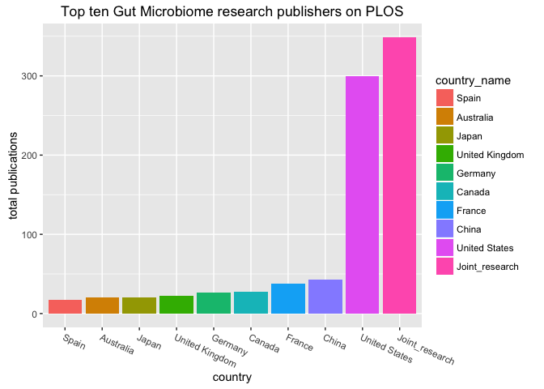
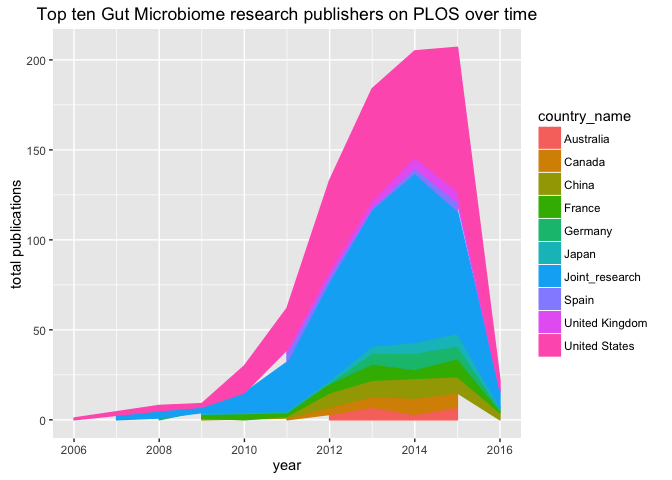
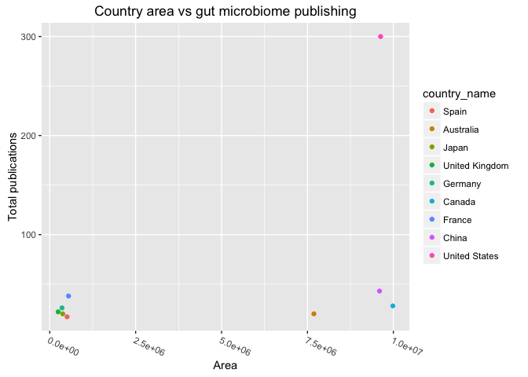

# Homework_10
David Choy  
December 5, 2015  

### Homework 10: Data from the Web

For this homework, we will use data downloaded from a wrapped API (rplos) and data from a package (geonames). I want to compare the publication of gut microbiome-related research between countries over time. I also want to see if the number of publications for a country has any correlation with the size of population.
    
#### 1. Load libraries

First, I will load the required libraries.


```r
suppressPackageStartupMessages(library(dplyr))
library(knitr)
options(geonamesUsername = "santina")   #knit html doesnt seem to pick up my rprofile 
library(geonames)    
library(ggplot2)
library(rplos)
library(parsedate)
library(countrycode)
```

#### 2. Search for "gut microbiome" papers using rplos' searchplos()

Then, I will search for gut microbiome papers using rplos


```r
articles <- searchplos(q= "gut microbiome", limit = 999,     #query gut microbiome, max 1000 articles
                       fl=c("id","author_affiliate,publication_date"), # return these values
                       fq=list('article_type:"Research Article"', "doc_type:full"))
articles_meta <- articles$meta
knitr::kable(articles_meta,format='markdown')
```


| numFound| start|maxScore |
|--------:|-----:|:--------|
|     1560|     0|NA       |

#### 3. Extract publication date and author affiliation

My search yielded 1503 results, however only a maximum of 1000 will be provided at any given search. Using this 1000 results, I will extract 2 pieces of information; the date that the paper was published and the authors' affiliations. 


```r
articles_data <- articles$data      #pull out only the data and not the metadata for this search
author_affiliate <- articles_data$author_affiliate   # extract the author affiliation text
author_pub_year <- articles_data$publication_date %>% # extract the publication date
  parse_date() %>% 
  format(.,'%Y') 

year_affiliate <- data.frame(year = author_pub_year, 
                             affiliation = author_affiliate) # combine year and author affiliation into 1 df
knitr::kable(year_affiliate %>% head(5),format='markdown')
```


|year |affiliation                                                                                                                                                                                                                                                                                                                                                                                                                                                                                                                                                                                                                 |
|:----|:---------------------------------------------------------------------------------------------------------------------------------------------------------------------------------------------------------------------------------------------------------------------------------------------------------------------------------------------------------------------------------------------------------------------------------------------------------------------------------------------------------------------------------------------------------------------------------------------------------------------------|
|2012 |School of Biological Sciences, Flinders University, Adelaide, South Australia, Australia; Plant Functional Biology and Climate Change Cluster (C3), University of Technology Sydney, Broadway, New South Wales, Australia                                                                                                                                                                                                                                                                                                                                                                                                   |
|2012 |Department of Biological Sciences, Louisiana State University, Baton Rouge, Louisiana, United States of America; Bioscience Division, MS 888, Los Alamos National Laboratory, Los Alamos, New Mexico, United States of America                                                                                                                                                                                                                                                                                                                                                                                              |
|2015 |Microbiology and Infection Unit, Division of Translational and Systems Medicine, Warwick Medical School, University of Warwick, Gibbet Hill Campus, Coventry, West Midlands, United Kingdom; National Institute of Health Research, Causeway, Harare, Zimbabwe; Murewa District Hospital, Murewa, Zimbabwe; Department of Biochemistry, University of Zimbabwe, Mount Pleasant, Harare, Zimbabwe; Insitute of Immunology and Infection Research, Centre for Immunology, Infection and Evolution, School of Biological Sciences, University of Edinburgh, Ashworth Laboratories, King’s Buildings, Edinburgh, United Kingdom |
|2013 |BioSciences R&D Division, TCS Innovation Labs, Tata Consultancy Services Ltd., Pune, Maharashtra, India; Translational Health Sciences and Technology Institute, Gurgaon, Haryana, India                                                                                                                                                                                                                                                                                                                                                                                                                                    |
|2014 |Bio Sciences R&D, TCS Innovation Labs, Pune, India; Center for Human Microbial Ecology, Translational Health Science and Technology Institute, Gurgaon, India; Society for Health and Demographic Surveillance, West Bengal, India; Department of Hepatology, School of Digestive and Liver Diseases, Institute of Post Graduate Medical Education and Research, Kolkata, India                                                                                                                                                                                                                                             |

#### 4. Extracting country names from author affiliation

The above table shows the date of publication for each result and the authors's affiliations. However, the affiliation informaiton is in the form of a long text and is not very useful in this form. So, next I will extract country names from this long text. To look for country names in a jumble of text, I used grepl() to look for country names in the affiliation text using a list of country names from isocode$name.


```r
isocodes$name %>% head()                        #contains all the country names used by rplos
countries <- lapply(year_affiliate$affiliation, #lapply loops through the affiliation column
  function(x){                                  #sapply loops thru the isocodes$names vector
    out <- sapply(isocodes$name, function(z) grepl(z, x)) #grepl returns TRUE on matches,
    isocodes$name[out]                          #which is used on the [ ] subset
  }

)
countries %>% head() 
```

```
## [1] "Andorra"              "United Arab Emirates" "Afghanistan"         
## [4] "Antigua and Barbuda"  "Anguilla"             "Albania"             
## [[1]]
## [1] "Australia"
## 
## [[2]]
## [1] "Mexico"        "United States"
## 
## [[3]]
## [1] "United Kingdom" "Zimbabwe"      
## 
## [[4]]
## [1] "India"
## 
## [[5]]
## [1] "India"
## 
## [[6]]
## [1] "China"         "United States"
```

#### 5. Collapsing multiple country names into one string

As we can see, some rows have more than 1 country because there was more than 1 country in the authors's affiliation. This shows that there were articles in which researchers from multiple countries collaborated together. While this is interesting information, it is unwieldy for my purposes, so I will first collapse the multiple countries into a single string using paste(,collapse). 

```r
countries_sort <- sapply(countries, function (x) paste(x,collapse=',')) #collapse multiple countries into a single string
year_affiliate$affiliation <- countries_sort #replace the long affiliation text with only the country names
colnames(year_affiliate)[2] <- "country_name"
knitr::kable(year_affiliate %>% head(5),format='markdown')
```


|year |country_name            |
|:----|:-----------------------|
|2012 |Australia               |
|2012 |Mexico,United States    |
|2015 |United Kingdom,Zimbabwe |
|2013 |India                   |
|2014 |India                   |


#### 6. Renaming observations with multiple countries or origin

As we can see in the table above, countries in observations with more than 1 country have been collapsed into a single string using a comma. Next, I will rename these collapsed country names into "Joint_research". With the help of these helper functions, I will then convert the observation with multiple countries into "Joint_research". 


```r
#helper functions
is_more_country <- function (x) {        # determines if a country_name has > 1 value
  if (grepl(",",x)) {
    x <- "Joint_research"                # if it does, rename it to Joint_research 
  } else x <- as.character(x)
}
year_affiliate[["country_name"]] <- year_affiliate[["country_name"]] %>% 
  sapply(., is_more_country)
knitr::kable(year_affiliate %>% head(5),format='markdown')
```


|year |country_name   |
|:----|:--------------|
|2012 |Australia      |
|2012 |Joint_research |
|2015 |Joint_research |
|2013 |India          |
|2014 |India          |

#### 7. Adding a country code column

I will add a new column called country_code which is the iso3 format of countries. Because the country names in rplos differs from that of geonames, having a standard iso3 format helps me merge the two datasets together later.


```r
convert_countrynames <- function (x) {   # convert country names into iso3 format
  if (x == "Joint_research") {           # for "Joint_research" country names, 
    "VAT"                                # fill in the country code with VAT
  } else {
    countrycode(x,"country.name","iso3c") #search for a country code for the country provided
  }
}
year_affiliate <- year_affiliate %>% mutate(country_code = sapply(country_name,convert_countrynames))
knitr::kable(year_affiliate %>% head(),format='markdown')
```


|year |country_name   |country_code |
|:----|:--------------|:------------|
|2012 |Australia      |AUS          |
|2012 |Joint_research |VAT          |
|2015 |Joint_research |VAT          |
|2013 |India          |IND          |
|2014 |India          |IND          |
|2013 |Joint_research |VAT          |

#### 8. Merging the rplos search results with geonames dataset

Now that the rplos results are nicely-formatted, I turn my attention to the geonames dataset. I will first select 2 columns that I am interested in; Area and the country code. Then, I will merge the rplos results with the geonames dataset using the country codes as a shared variable.


```r
countryInfo <- GNcountryInfo() # pull in the general country info
country_area <- countryInfo %>% 
  select(areaInSqKm,isoAlpha3); #jeep only the name, area and country code
knitr::kable(country_area %>% head(),format='markdown')     
```


|areaInSqKm |isoAlpha3 |
|:----------|:---------|
|468.0      |AND       |
|82880.0    |ARE       |
|647500.0   |AFG       |
|443.0      |ATG       |
|102.0      |AIA       |
|28748.0    |ALB       |

```r
year_country_area <- merge(year_affiliate,    # merge rplos data with geonames data
                           country_area,
                           by.x = "country_code",
                           by.y = "isoAlpha3")
knitr::kable(year_country_area %>% head(),format='markdown')
```


|country_code |year |country_name |areaInSqKm |
|:------------|:----|:------------|:----------|
|ARG          |2014 |Argentina    |2766890.0  |
|AUS          |2012 |Australia    |7686850.0  |
|AUS          |2015 |Australia    |7686850.0  |
|AUS          |2015 |Australia    |7686850.0  |
|AUS          |2012 |Australia    |7686850.0  |
|AUS          |2015 |Australia    |7686850.0  |

#### 9. Comparing total gut microbiome publications per country

Now that I have merged both datasets, its time to analyze the data. First, I will calculate the total publications made by each country . Then I will calculate the publications made by each country each year

```r
publication_total <- year_country_area %>%   # publications for each country (all years' total)
  group_by(country_name) %>% 
  summarize(total_pubs = n())
publication_peryear <- year_country_area %>%   # publications per country per year
  group_by(country_name,year) %>% 
  summarize(pubs_peryear = n()) 
knitr::kable(publication_total %>% head(5),format='markdown')
```


|country_name | total_pubs|
|:------------|----------:|
|Argentina    |          1|
|Australia    |         20|
|Austria      |          3|
|Belgium      |          9|
|Brazil       |          9|

```r
knitr::kable(publication_peryear %>% head(5),format='markdown')
```


|country_name |year | pubs_peryear|
|:------------|:----|------------:|
|Argentina    |2014 |            1|
|Australia    |2012 |            3|
|Australia    |2013 |            7|
|Australia    |2014 |            3|
|Australia    |2015 |            7|

#### 10. Selecting for the top 10 publishing countries
There are too many countries in this dataset to show clearly on a plot or table so I will narrow them down to the top 10 contributors


```r
top_ten_pubs <- publication_total %>%     
  arrange(desc(total_pubs)) %>% 
  head(10) %>% 
  mutate(country_name = reorder(country_name,total_pubs))
top_ten_pubs_by_year<- publication_peryear %>% 
  filter(any(country_name == top_ten_pubs$country_name))
knitr::kable(top_ten_pubs,format='markdown')
```


|country_name   | total_pubs|
|:--------------|----------:|
|Joint_research |        349|
|United States  |        300|
|China          |         43|
|France         |         38|
|Canada         |         28|
|Germany        |         26|
|United Kingdom |         22|
|Australia      |         20|
|Japan          |         20|
|Spain          |         17|

```r
knitr::kable(top_ten_pubs_by_year %>% head(),format='markdown')
```


|country_name |year | pubs_peryear|
|:------------|:----|------------:|
|Australia    |2012 |            3|
|Australia    |2013 |            7|
|Australia    |2014 |            3|
|Australia    |2015 |            7|
|Canada       |2011 |            1|
|Canada       |2012 |            4|

#### 11. factor-ing the country_name and un-factoring the year variable for plotting
Now that we have the data in a ready-to-plot format, there is one more fix before we can plot. While merging the datasets, some factors were lost and some variables were co-erced into factors. Without proper factors, it is hard to use ggplot2 to properly display our data. Here, we re-factor the country_name variable and co-erce the year variable into an integer.


```r
top_ten_pubs_by_year[[1]] <- top_ten_pubs_by_year[[1]] %>% as.factor()
top_ten_pubs_by_year[[2]] <- top_ten_pubs_by_year[[2]] %>% as.character() %>% as.integer()
```

#### 12. Plotting the top ten gut microbiome research contributors

With year set as integer and country name as factor, we can plot the top ten publishing countries for gut microbiome


```r
plot1 <- top_ten_pubs %>%    #plot the top ten publishing contributors by total
  ggplot(aes(x=country_name, y=total_pubs,fill = country_name)) + 
  geom_bar(stat="identity") + 
  theme(axis.text.x = element_text(angle =-25, vjust = 1, hjust=0)) +
  xlab("country") +
  ylab("total publications") +
  ggtitle("Top ten Gut Microbiome research publishers on PLOS")
plot2 <- top_ten_pubs_by_year %>%    #plot the top ten publishing contributors over time
  ggplot(aes(x=year,y=pubs_peryear, color = country_name,fill=country_name)) + 
  geom_area() +
  xlab("year") +
  ylab("total publications") +
  ggtitle("Top ten Gut Microbiome research publishers on PLOS over time")
plot1
```

 

```r
plot2
```

 

#### 13. Area of country vs publishing of gut microbiome research (excluding Joint research)

We can see that joint research is the highest contributor to gut microbiome research, suggesting that collaboration gets the most work done in research. This is unsurprisinly followed by the US and China which are known leaders in gut microbiome research. Of note is that Canada is the 4th highest contributor to gut microbiome research which is a significant achievement. There aren't any clear trends over time although there is a sudden increase between 2011 - 2013 and a decline/slowdown after 2014. We now compare the Area of a country to its contribution to microbiome research.


```r
area_from_country <- function(c) {
  year_country_area %>% filter(country_name == c) %>% .[["areaInSqKm"]] %>% .[1]
}
top_nine_pubs <- top_ten_pubs %>% filter(country_name != "Joint_research")

top_nine_pubs_area <- top_nine_pubs %>% 
  mutate(area = sapply(top_nine_pubs[["country_name"]],area_from_country)) 
top_nine_pubs_area[["area"]] <- top_nine_pubs_area[["area"]] %>% as.character() %>% as.numeric()
knitr::kable(top_nine_pubs_area)
```


country_name      total_pubs      area
---------------  -----------  --------
United States            300   9629091
China                     43   9596960
France                    38    547030
Canada                    28   9984670
Germany                   26    357021
United Kingdom            22    244820
Australia                 20   7686850
Japan                     20    377835
Spain                     17    504782

```r
plot3 <- top_nine_pubs_area %>% ggplot(aes(x=area,y=total_pubs,fill=country_name,color=country_name)) +   geom_point() +
  theme(axis.text.x = element_text(angle =-25, vjust = 1, hjust=0)) +
  xlab("Area") +
  ylab("Total publications") +
  ggtitle("Country area vs gut microbiome publishing")
plot3
```

 

In conclusion, we see no relationship between Area of a country and the contribution it makes to microbiome research. This shows that country size does not have any obvious effect on science advancement in the gut microbiome field.
