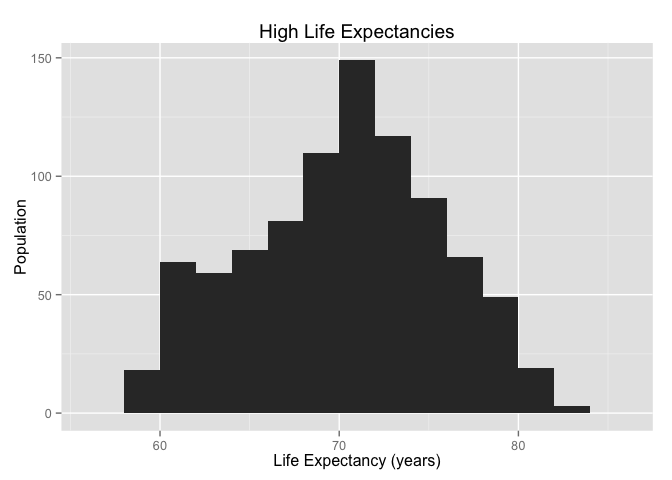
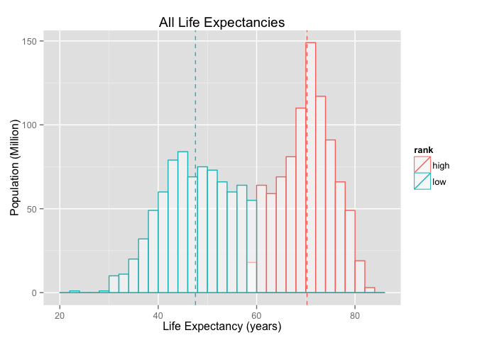
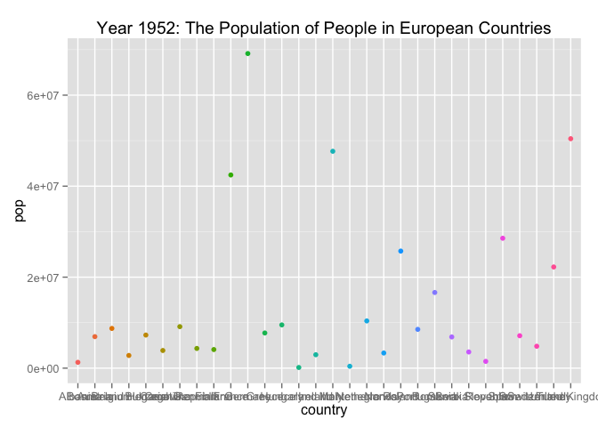
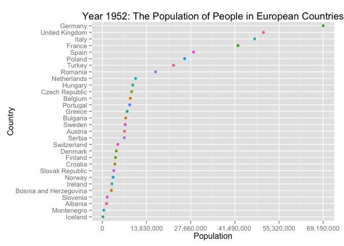

# Homework 2
David Choy  
September 28, 2015  
___
###Homework steps available [here](http://stat545-ubc.github.io/hw02_explore-gapminder-use-rmarkdown.html) :
####1. Bring data in

Before I begin any work, I bring the libraries that I know I will need in.

```r
library(knitr)
library(ggplot2)
library(scales)
library(markdown)
```
Let us then compare read.table() versus read.delim() using their default parameters. read.delim() works fine but read.table() throws an error that some rows have missing values. To substitute for the missing values, we add fill = TRUE to read.table() to fill in blank values where values are missing.

```r
gapminder1 <- read.delim(file = "gapminderDataFiveYear.txt" )   
#gapminder2 <- read.table(file ="gapminderDataFiveYear.txt")   # read.table() throws an error
#Error in scan(file, what, nmax, sep, dec,...,  :line 146 did not have 6 elements
gapminder2 <- read.table(file = "gapminderDataFiveYear.txt",fill = TRUE)
```

However, the read.table() import is still broken as we will see in a second. Using:    

1. Identical(), we can see that read.delim() and read.table() do not import the same dataframe although they extracted from the same file  
2. str() and view(), we look at the summary of the data and notice that  
    a. there are more variables in the read.table() dataset  
    b. the read.table()dataset lacks column headers and proper classes   
    c. the column headers are being included as data  
    d. space(" ") is being used as separators instead of tab  
    e. single quotes(' ') are being used as quotes instead of being treated as an apostrophe  
3. To fix, I copy over the default args of read.delim() to read.table()  


```r
identical(gapminder1,gapminder2)    #1
str(gapminder1); str(gapminder2)    #2                    
#View(gapminder2);                  
gapminder2fixed <- read.table(file = "gapminderDataFiveYear.txt", header = TRUE, sep = "\t", quote ="\"", dec = 
                   ".", fill = TRUE, comment.char = "" )  #3
identical(gapminder1,gapminder2fixed)     #Yay! Identical!
```

```
## [1] FALSE
## 'data.frame':	1704 obs. of  6 variables:
##  $ country  : Factor w/ 142 levels "Afghanistan",..: 1 1 1 1 1 1 1 1 1 1 ...
##  $ year     : int  1952 1957 1962 1967 1972 1977 1982 1987 1992 1997 ...
##  $ pop      : num  8425333 9240934 10267083 11537966 13079460 ...
##  $ continent: Factor w/ 5 levels "Africa","Americas",..: 3 3 3 3 3 3 3 3 3 3 ...
##  $ lifeExp  : num  28.8 30.3 32 34 36.1 ...
##  $ gdpPercap: num  779 821 853 836 740 ...
## 'data.frame':	2029 obs. of  6 variables:
##  $ V1: Factor w/ 442 levels "1004.484437",..: 333 301 301 301 301 301 301 301 301 301 ...
##  $ V2: Factor w/ 131 levels "","1070.013275",..: 130 20 21 22 23 24 25 26 27 28 ...
##  $ V3: Factor w/ 1424 levels "","1000281000",..: 1421 1292 1362 29 112 179 242 169 205 288 ...
##  $ V4: Factor w/ 249 levels "","10161915",..: 245 244 244 244 244 244 244 244 244 244 ...
##  $ V5: Factor w/ 1418 levels "","1039009","1056608",..: 1417 48 52 57 71 86 121 148 179 199 ...
##  $ V6: Factor w/ 1637 levels "","1002.199172",..: 1637 1441 1485 1516 1498 1369 1450 1616 1514 1194 ...
## [1] TRUE
```

####2. Smell test the data
Now that we have configured read.table(), we can use either of the identical datasets to do some analysis. For simplicity, I will use the data imported via read.delim(). The fastest way to check out a data is using str() which includes the following description for datasets:


```r
str(gapminder1)         # it has 1704 observations/rows and 6 variables
                        # first column, country is a factor with 142 levels
                        # second column, year are integers
                        # third column, population are numerics
                        # fourth column, continent are factors with 5 levels
                        # fifth column, lifeExp are numerics
                        # sixth column, gdpPercap are numerics                        
#2. alternatively a more tedious way to do it is to use the following functions or for loops:
ncol(gapminder1)        # number of columns, use with df/tables/matrices
nrow(gapminder1)        # number of rows, use with df/tables/matrices
length(gapminder1)      # it is a list with 6 variables (columns), generic-use
length(gapminder1[,1])  # column 1 of the list has 1704 observations, generic-use
# and.... a for loop that checks class of each column
z <- NULL;       for (i in 1:length(gapminder1)) {z <- c(z, class(gapminder1[,i]))};     z;   
```

```
## 'data.frame':	1704 obs. of  6 variables:
##  $ country  : Factor w/ 142 levels "Afghanistan",..: 1 1 1 1 1 1 1 1 1 1 ...
##  $ year     : int  1952 1957 1962 1967 1972 1977 1982 1987 1992 1997 ...
##  $ pop      : num  8425333 9240934 10267083 11537966 13079460 ...
##  $ continent: Factor w/ 5 levels "Africa","Americas",..: 3 3 3 3 3 3 3 3 3 3 ...
##  $ lifeExp  : num  28.8 30.3 32 34 36.1 ...
##  $ gdpPercap: num  779 821 853 836 740 ...
## [1] 6
## [1] 1704
## [1] 6
## [1] 1704
## [1] "factor"  "integer" "numeric" "factor"  "numeric" "numeric"
```

####3. Explore variables. Part 1: Quantitative variable, Life Expectancy

Now that we have a rough overview of the data, we can pick some variables to explore. I have chosen life expectancy as my quantitative variable to explore. I will first use :  

1. subset() to subset only the life expectancy column from the gapminder dataset, excluding all NA and NaN values
2. summary() to generate a statistics report of all life expectancy in the data, which provides min/max values, mean, etc
3. subset() the life expectancy dataframe further into 'high life expectancy' and 'low life expectancy' using the mean as the midpoint
4. add a new column to each dataframe called "ranking" to indicate the rows that have 'high' or 'low' life expectancies. cbind() is more versatile.
5. rbind() to recombine the 'high' and 'low' life expectancy dataframes into one dataframe


```r
alllifeExp <- subset(gapminder1, subset = (!is.na(lifeExp) | !is.nan(lifeExp)),select = 'lifeExp');   #1
summary(alllifeExp)              #2 
      
alllifeExp_mean <- mean(gapminder1$lifeExp);    #3
highlifeExp <- subset(gapminder1,subset = (lifeExp > alllifeExp_mean),select = 'lifeExp');  
lowlifeExp <- subset(gapminder1,subset = (lifeExp < alllifeExp_mean),select = 'lifeExp'); 
highlifeExp$rank <- c("high");    #4
lowlifeExp$rank <- c("low");
alllifeExp_ranked <- rbind(highlifeExp,lowlifeExp); summary(alllifeExp_ranked)  #5
```

```
##     lifeExp     
##  Min.   :23.60  
##  1st Qu.:48.20  
##  Median :60.71  
##  Mean   :59.47  
##  3rd Qu.:70.85  
##  Max.   :82.60  
##     lifeExp          rank          
##  Min.   :23.60   Length:1704       
##  1st Qu.:48.20   Class :character  
##  Median :60.71   Mode  :character  
##  Mean   :59.47                     
##  3rd Qu.:70.85                     
##  Max.   :82.60
```

####4. Explore ggplot2. Part 1: Quantitative variable, Life Expectancy histogram  

Now that we have data that is a little sorted, we can do more interesting things with a histogram plot using ggplot2. As a reference, most of my code is written based on [this link](http://www.sthda.com/english/wiki/ggplot2-histogram-plot-quick-start-guide-r-software-and-data-visualization). My first step is plotting a basic histogram of just the high life expectancy population to look at the data distribution at the higher end.

* A basic histogram   
       * aes (x = which column to draw)
       * the + sign allows us to add modifications, overlaying plots onto the main plot
       * geom_histogram = plot type
       * binwidth = histogram unit)
       
* A more advanced histogram (two or more subsets of data in one histogram)
       * ggplot(color = ) choose which column to sort using color, i.e. if ranking is chosen, 'high' and 'low' will be colored differently)
       * geom_histogram (draws a histogram)
        * alpha = transparency
        * position = where to place the bars  
          * "identity" means place exactly where the value is
          * "dodge" means interleave the bars if they overlap))
       * geom_vline (draws a Vertical(v) line). 'plyr' package is used to calculate the mean of the 'high' and 'low' lifeExp columns
        * 'ddply'
          * data = your_data
          * .(column_name) = sort using the groups in this column
          * 'summarize' creates a condensed dataframe. alternatively, 'mutate' & 'transform' allow you to change the data without condensing it
          * lifeExpmean = mean(lifeExp). lifeExpmean will create a new column with the header lifeExpmean. = mean(lifeExp) will fill in the rows of the column using the formula specified

```r
# a basic histogram
highlifeExp_plot_simple   <- ggplot(highlifeExp, aes(x=lifeExp)) +
                             geom_histogram(binwidth = 2) +
                             labs (title = "High Life Expectancies", 
                                  x = "Life Expectancy (years)",
                                  y="Population"); 
highlifeExp_plot_simple;

#a more advanced histogram
library(plyr)
alllifeExp_ranked_means   <- ddply(alllifeExp_ranked, .(rank), summarize,  lifeExpmean=mean(lifeExp));
alE_rmeans                <- alllifeExp_ranked_means
alllifeExpPlot <- ggplot(alllifeExp_ranked, aes(x=lifeExp, color=rank)) +
                  geom_histogram(fill="white", binwidth = 2,alpha = 0.5, position = "identity") +
                  geom_vline(data = alE_rmeans, aes(xintercept=lifeExpmean, color=rank), linetype="dashed") +
                  labs (title = "All Life Expectancies", 
                        x = "Life Expectancy (years)",
                        y="Population (Million)")
alllifeExpPlot;
```



####4. Part 2: Categorical & Quantitative variable, Country & Population

When there are 2 or more variables that we want to compare/correlate, we can used scatterplots to see if there are any trends in the data. The creation of a scatterplot only requires that we include a:
* geompoint() to ggplot()

However, to create a plot that has meaningful trends and that is readable, we can:  

* reorder() the data in a particular order (lowest -> highest)
* customize the labels, labs(), and theme, theme()
* transpose the axis using coord_flip()
* change the y-axis tick labels using scale_y_continuous()
* and many more ...

```r
allEuropecountry1952 <- subset(gapminder1, (year == 1952) & (continent == 'Europe') , select = c(country,pop)); 
```

```r
# Basic scatterplot      
allEuropecountry1952plot <- ggplot(allEuropecountry1952, aes(x = country, y = pop, color = country)) +
                            geom_point() +
                            theme(legend.position = "none") +
                            labs(title = "Year 1952: The Population of People in European Countries")
allEuropecountry1952plot;
      
# Beautified scatterplot
num_of_breaks <- 5;
max_pop <- (summary(allEuropecountry1952$pop))[6]; 
pop_breaks = seq (from = 0, to = max_pop, by = (max_pop/num_of_breaks)); 

aec1952plot_reorder <- ggplot(allEuropecountry1952, aes(x = reorder(country,pop), y = pop, color = country)) +
                       geom_point() +
                       theme(axis.text.x = element_text(angle = 0, vjust = 1, hjust=0.5)) +
                       theme(legend.position = "none") +
                       labs(title = "Year 1952: The Population of People in European Countries", 
                            x = "Country", y = "Population") +
                       scale_y_continuous(breaks=pop_breaks,labels = comma) +
                       coord_flip();
aec1952plot_reorder;
```



___
##The End! Thanks for reading
      
      
      
      


