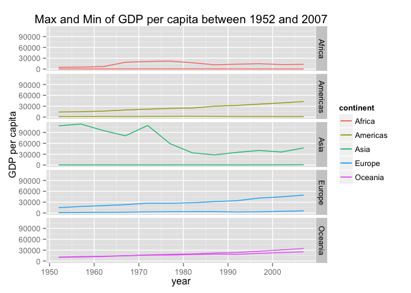
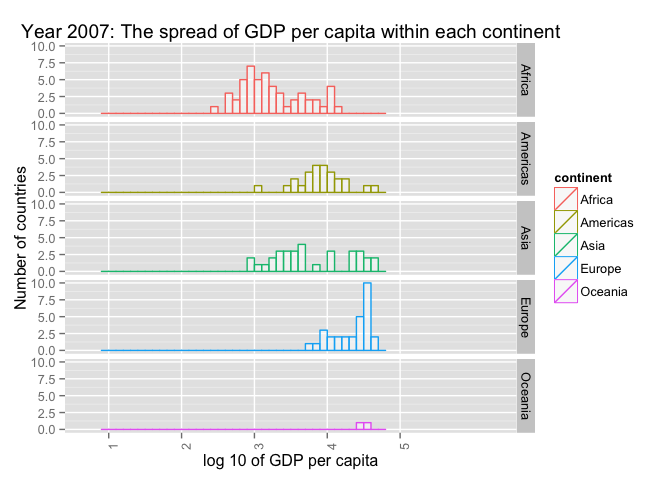
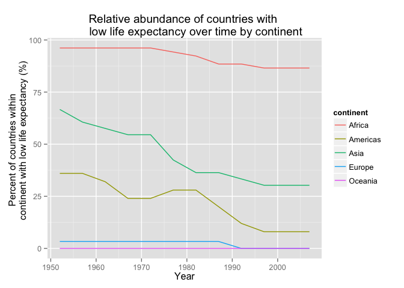
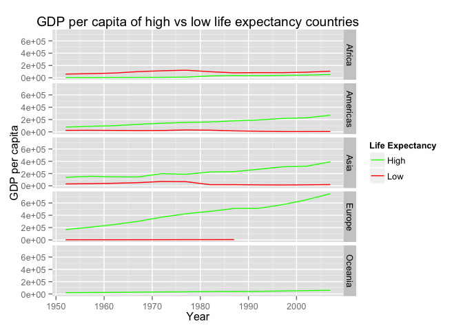

# Homework 3
David Choy  
October 2nd, 2015  
___
###Homework steps available [here](http://stat545-ubc.github.io/hw03_dplyr-and-more-ggplot2.html#task-menu) :

####1. First, I will bring libraries and data in

```r
library(gapminder)
library(ggplot2)
suppressPackageStartupMessages(library(dplyr))
options(knitr.table.format = 'markdown') #knitr::kable() does not seem to render on the .md files in github
```
####2. Converting dataframe to table_dataframe
For the purpose of this homework, I will convert the dataframe into a table_dataframe using tbl_df() from the dplyr package. Then, I will look at a review of the tbl_dataframe using glimpse(). In this homework, we introduce the use of the pipe command, %>% , which allows us to apply functions to our data sequentially. 

```r
gtbl <- tbl_df(gapminder)
gtbl %>% glimpse        # gtbl %>% glimpse = glimpse(gtbl) =~ str(gtbl)     
```

```
## Observations: 1,704
## Variables: 6
## $ country   (fctr) Afghanistan, Afghanistan, Afghanistan, Afghanistan,...
## $ continent (fctr) Asia, Asia, Asia, Asia, Asia, Asia, Asia, Asia, Asi...
## $ year      (dbl) 1952, 1957, 1962, 1967, 1972, 1977, 1982, 1987, 1992...
## $ lifeExp   (dbl) 28.801, 30.332, 31.997, 34.020, 36.088, 38.438, 39.8...
## $ pop       (dbl) 8425333, 9240934, 10267083, 11537966, 13079460, 1488...
## $ gdpPercap (dbl) 779.4453, 820.8530, 853.1007, 836.1971, 739.9811, 78...
```
####3. Task 1 of 3: Get maximum and mininum of GDP per capita for all continents
1. To compare the gdpPercap between continents, I will first group the data by continents. I also want to show how the gdpPercap changes over time so I will also group the data by year.
2. Now that the data is grouped by continent and year, we apply summarize(). What summarize does is create new columns and drops all columns that are not specified in group_by(). In this case, I created 2 new columns, max,min and dropped country,pop,lifeExp. I retained continent and year as they were previously specified in group_by.

```r
maxminGDP <- gtbl %>%    # Original code. I did not place this into a table as it is too long
  group_by(continent,year) %>%      #1. grouping by continent and year
  summarize(max_GDP_perCap = max(gdpPercap),   #2. summarize creates new columns
            min_GDP_perCap = min(gdpPercap))   #2. , drops unspecified columns, retains grouped
```

```r
maxminGDP_test <- gtbl %>%    # Simpler code for making table. Here, I have collapsed the year column 
  group_by(continent) %>%     # by not including it in the group_by()
  summarize(max_GDP_perCap = max(gdpPercap),
            min_GDP_perCap = min(gdpPercap))
knitr::kable(maxminGDP_test);
```


|continent | max_GDP_perCap| min_GDP_perCap|
|:---------|--------------:|--------------:|
|Africa    |       21951.21|       241.1659|
|Americas  |       42951.65|      1201.6372|
|Asia      |      113523.13|       331.0000|
|Europe    |       49357.19|       973.5332|
|Oceania   |       34435.37|     10039.5956|

4. Here is the plot showing the trend of max and min of gdpPercap over the years


```r
maxminGDP %>% 
  ggplot(aes(x = year)) +     # x = selects the column to be used for plotting as x values
  geom_line(aes(y=max_GDP_perCap, color = continent)) +     #geom_line plots a line using the desired y values
  geom_line(aes(y=min_GDP_perCap, color = continent)) +     #continents are colored differently using color =
  facet_grid(continent ~ .) +   # facet_grid splits the plot by continents
  labs(title = "Max and Min of GDP per capita between 1952 and 2007", 
                            x = "year", y = "GDP per capita")
```

 

5. Patterns in this data
   * Table: The Asias have the highest maximum GDP per capita while the Africas have the lowest minimum of GDP per capita. 
   * Line plot: The Asias have the largest divide between minimum and maximum GDP per capita while the Oceanias have the smallest divide. Other than the Asias and Africas, the difference between max and min of GDP per capita of all other continents appear to be increasing steadily over time.
   
####4. Task 2 of 3:Look at the spread of GDP per capita within continents
1. In this task, I will look at the distribution of the gdpPercap of countries within each continent using a histogram. Since gdp per capita of 1952 and 2007 is likely going to be vastly different, it wouldn't be reasonable to use the average gdpPercapita over the years. Instead, I will only use the 2007 data so that each country within a continent only has a single gdpPercap value. 
    * First, I subset only the rows with the year variable = "2007"
    * Then, I subset only the columns that I want using select()
    * Finally, I sort the data alphabetically by continent and then in ascending order by gdpPercap using arrange()
    * This creates a new dataframe of only continent, country and gdpPercap that we can use for plotting
    * To create a table, we have to summarize the data further by grouping the data by continent (and collapsing the country column) and using summarize() to calculate the mean, median and standard deviation of the gdpPercap for each continent

```r
gdpPercap_of_country_2007 <- gtbl %>% 
  filter(year == "2007") %>%        #1. subset only rows with year = 2007
  select(continent, country,gdpPercap) %>%   #1. select only the columns continent,country, gdpPercap
  arrange(continent, gdpPercap) #1. arrange the rows by continent(alphabetically) and then by gdpPercap (ascending value)
   
gdpPercap_of_continent_2007<- gdpPercap_of_country_2007 %>% 
  group_by(continent) %>% # grouping the data by continent
  summarize(mean(gdpPercap),  # calculate mean of gdpPercap for all countries within continent
            median(gdpPercap), # same for median
            sd(gdpPercap))  # same for standard deviation
knitr::kable(gdpPercap_of_continent_2007);  
```


|continent | mean(gdpPercap)| median(gdpPercap)| sd(gdpPercap)|
|:---------|---------------:|-----------------:|-------------:|
|Africa    |        3089.033|          1452.267|      3618.163|
|Americas  |       11003.032|          8948.103|      9713.209|
|Asia      |       12473.027|          4471.062|     14154.937|
|Europe    |       25054.482|         28054.066|     11800.340|
|Oceania   |       29810.188|         29810.188|      6540.991|

2. To plot the spread of data, I use a histogram.
    * ggplot() allows me to select the exact columns in the data I want to use. In this case, I have applied log10 to the column gdpPercap to obtain a more visually representative histogram
    * geom_histogram() = creates a histogram plot from the data
    * facet_grid() splits the plots according to the arguments provided. In this case, I am splitting the plots by continent
    * theme(axis.text.x) allows me to modify the text of the x-axis via rotation and vertical/horizontal shifting
    * scale_x_discrete allows me to change the number of breaks (i.e. major ticks) in the x axis

```r
# spread by continent
gdpPercap_of_country_2007 %>% 
  ggplot(aes(x=log10(gdpPercap), color = continent)) +   # log10 of gdpPercap for better visualization
  geom_histogram(fill="white", binwidth = 0.1,alpha = 0.5, position = "dodge") +   # draw histogram with interleaved bars
  facet_grid(continent ~ .) + # split histogram by continent
  theme(axis.text.x = element_text(angle = 90, vjust = 1, hjust=0)) +  # rotate the x axis text 90 deg
  scale_x_discrete(breaks = c(1:5)) +  # split the x axis using major ticks at 1,2,3,4 and 5
  labs(title = "Year 2007: The spread of GDP per capita within each continent", 
                            x = "log 10 of GDP per capita", y = "Number of countries")
```

 

3. Patterns in the data:
    * Table: 
        * Oceania has the highest average GDP percap while Africa has the lowest. 
        * Asia has the highest standard deviation of GDP percap which is supported by our previous observation in Task 1 that Asia has the largest divide between max and min GDP percap
    * Plot: 
        * The distribution of GDP per capita is vastly different between continents. 
        * Only the Americas follow a 'normal distribution'-like shape 
        * The distribution in Asia is showing a sharp divide in GDP per capita between log(3.8) and log(4.2)

#### Task 3 of 3: Report the relative abundance of countries with low life expectancy over time by continent
1. Before I begin the analysis, I define some of the terms used:
    * low life expectancy = life expectancy < mean life expectancy
    * mean life expectancy = mean of all countries life expectancy by year
2. Next, I calculate the mean life expectancy for each year inside a dataframe

```r
world_lifeExpmean <- gtbl %>%  
  select(year, lifeExp) %>%     # select only the columns 'year' and 'lifeExp'
  group_by(year) %>%            # group the data by year
  summarize(mean_lifeExp = mean(lifeExp))    # create a new column called mean_lifeExp which is 
                                              # the mean life expectancy for each year
world_lifeExpmean;
```

```
## Source: local data frame [12 x 2]
## 
##     year mean_lifeExp
##    (dbl)        (dbl)
## 1   1952     49.05762
## 2   1957     51.50740
## 3   1962     53.60925
## 4   1967     55.67829
## 5   1972     57.64739
## 6   1977     59.57016
## 7   1982     61.53320
## 8   1987     63.21261
## 9   1992     64.16034
## 10  1997     65.01468
## 11  2002     65.69492
## 12  2007     67.00742
```

3. Now that I have the average life expectancies for each year, I can add it to the gapminder dataframe. Then I can calculate whether lifeExp for a given row is less than the mean_lifeExp for the year. rep(vector,times) is used to repeat the mean_lifeExp vector of 12 elements 142 times to match the number of rows of gapminder (1704 rows)

```r
gtbl_showlifeExp <- gtbl %>% 
  mutate(mean_lifeExp = rep(world_lifeExpmean$mean_lifeExp,142)) %>%   # add column of mean_lifeExp
  mutate(islowlife = (lifeExp < mean_lifeExp)) %>% # add column to indicate if lifeExp <  mean_lifeExp
  select(continent,country,year,lifeExp,mean_lifeExp,islowlife) # drop 'pop'
gtbl_showlifeExp;
```

```
## Source: local data frame [1,704 x 6]
## 
##    continent     country  year lifeExp mean_lifeExp islowlife
##       (fctr)      (fctr) (dbl)   (dbl)        (dbl)     (lgl)
## 1       Asia Afghanistan  1952  28.801     49.05762      TRUE
## 2       Asia Afghanistan  1957  30.332     51.50740      TRUE
## 3       Asia Afghanistan  1962  31.997     53.60925      TRUE
## 4       Asia Afghanistan  1967  34.020     55.67829      TRUE
## 5       Asia Afghanistan  1972  36.088     57.64739      TRUE
## 6       Asia Afghanistan  1977  38.438     59.57016      TRUE
## 7       Asia Afghanistan  1982  39.854     61.53320      TRUE
## 8       Asia Afghanistan  1987  40.822     63.21261      TRUE
## 9       Asia Afghanistan  1992  41.674     64.16034      TRUE
## 10      Asia Afghanistan  1997  41.763     65.01468      TRUE
## ..       ...         ...   ...     ...          ...       ...
```

4. Next, I sum up the number of countries with low life expectancies for each continent and for each year. I can then calculate the percentage of countries in a continent that have low life expectancies.


```r
percent_life_exp <- gtbl_showlifeExp %>% 
  group_by(continent,year) %>%            # group data by continent and year
  summarize(n_countries_lowlife = sum(islowlife),# count number of low life expectancy countries per continent
            n_countries_total = n(),   # count total countries per continent
            percent_lowlife = 100* n_countries_lowlife/n_countries_total) # calculate percentage of lowlife countries in each continent

table_life_exp <- percent_life_exp %>% 
  group_by(continent) %>% 
  summarize(max_percent_lowlife = max(percent_lowlife),
            min_percent_lowlife = min(percent_lowlife))
knitr::kable(table_life_exp)
```


|continent | max_percent_lowlife| min_percent_lowlife|
|:---------|-------------------:|-------------------:|
|Africa    |           96.153846|            86.53846|
|Americas  |           36.000000|             8.00000|
|Asia      |           66.666667|            30.30303|
|Europe    |            3.333333|             0.00000|
|Oceania   |            0.000000|             0.00000|

5. Here is the plot of the percentage of counties per continent with low life expectancies (over time)


```r
percent_life_exp %>% 
  ggplot(aes(x = year, color = continent, y=percent_lowlife)) + 
  geom_line() +      # draws a line plot
  labs(title = "Relative abundance of countries with 
       low life expectancy over time by continent", 
       x = "Year", 
       y = "Percent of countries within 
       continent with low life expectancy (%) ")
```

 

6. Patterns in the data:
    * Table: Africa has the highest percentage of countries with both maximum and minimum low life expectancies while Oceania has the lowest
    * Plot: 
        * In general, there is a decrease in low life expectancy in all continents
        * Asia has had the sharpest decline in low life expectancy between 1952 - 2007
        * The Americas had an unexpected increase in low life expectancy between 1972 - 1982
        * The Africas, Europe and Oceania have relatively less change in life expectancy

####Task 4 of 3: Compare the average GDPpercap of high life vs low life expectancy countries 
1. To differentiate the countries, I create a new column called islowlife to determine if the life expectancies are below or above mean life expectancy
2. Then, using group() and summarize(sum()), I calculate the total GDP per capita:
    * per continent,
    * per year,
    * of countries that have low or high life expectancies
3. There would be too much data to show for all years so we show only data from the year 2007 in the table

```r
GDP_percap_highlow<- gtbl %>%  
  mutate(world_lifeExpmean = rep(world_lifeExpmean$mean_lifeExp,142),   #1. calculate each year's world life exp mean
         islowlife = lifeExp < world_lifeExpmean) %>%  #1. create a column to indicate low life exp.
  group_by(continent,year,islowlife) %>% #2. group data by continent,year,and life exp
  summarize(total_countries = n(),
            total_GDP_percap = sum(gdpPercap))  #2. calculate the total GDP per capita for each subgroup
GDP_percap_highlow %>% 
  filter(year == "2007") %>%    #3. Only draw the table for year 2007
  knitr::kable();
```


|continent | year|islowlife | total_countries| total_GDP_percap|
|:---------|----:|:---------|---------------:|----------------:|
|Africa    | 2007|FALSE     |               7|        53402.260|
|Africa    | 2007|TRUE      |              45|       107227.436|
|Americas  | 2007|FALSE     |              23|       270052.016|
|Americas  | 2007|TRUE      |               2|         5023.774|
|Asia      | 2007|FALSE     |              23|       390589.152|
|Asia      | 2007|TRUE      |              10|        21020.735|
|Europe    | 2007|FALSE     |              30|       751634.449|
|Oceania   | 2007|FALSE     |               2|        59620.377|

4. For the line plot, we can include data from all the years.  


```r
GDP_percap_highlow %>% 
  ggplot(aes(x=year, color = islowlife, y = total_GDP_percap)) +  
  geom_line() +
  scale_colour_manual(values = c("green","red"),
                      name= "Life Expectancy",
                      labels = c("High", "Low")) +
  facet_grid(continent ~.) +
  labs(title = "GDP per capita of high vs low life expectancy countries", 
                            x = "Year", y = "GDP per capita")
```

 

5. Patterns in the data:
    * Table: 
        * Africa has the highest number of countries with low life expectancy while Europe has the highest number of countries with high life expectancy
        * Oceania and Europe do not have countries with low life expectancy in the year 2007
    * Line plot: 
        * The GDP per capita in the Americas, Asia and Europe have been increasing at a high rate between 1952 and 2007
        * The countries of low life expectancy in Africa appear to contribute more to the continent's GDP per capita than the countries with high life expectancy. In the other continents, countries with high life expectancy contribute more to their continent's GDP per capita.
        * No countries in Oceania were ever low in life expectancy in any of the years
        * Since 1987, Europe no longer has countries with low life expectancy
        
        
#### The End! Thanks for reading!
