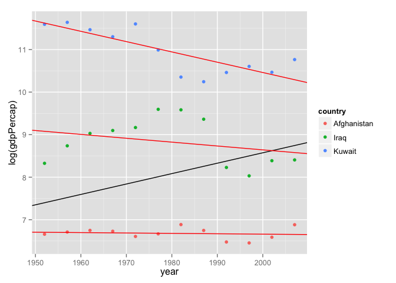
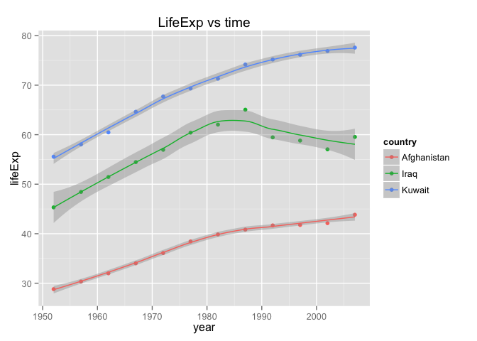
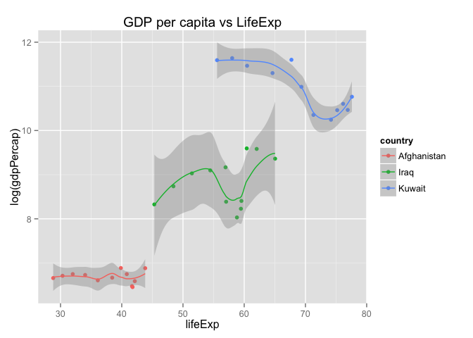
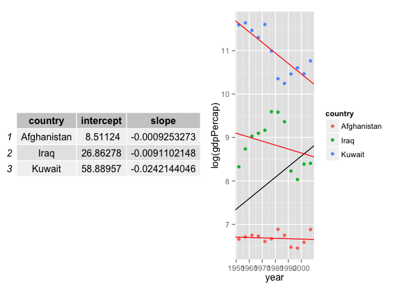

# Homework_4
David Choy  
October 16, 2015  

Homework steps available [here](http://stat545-ubc.github.io/hw04_write-function-split-apply-combine.html)

### Main Objective:
For this homework, I will create a function called GDPpercap_vs_year_of_continent(). This function will calculate the linear regression fit for any country and continent's GDP per capita. Then, depending on the arguments we want, the function will automatically produce a table, a plot or both of the results. I also added some extra last minute features to compare life expectancy with GDP per capita.

### Steps:

1. As always the first step is to load the libraries

```r
library(plyr)
suppressPackageStartupMessages(library(dplyr))
library(gapminder)
library(ggplot2)
library(gridExtra)
#library(cowplot)     # <- cowplot changes the look of my plots but allows grid-like publication figures
                      # it also allows me to overlay any generic image/text on top of plots
```

2. To create the function, I have learned a few new R functions:

    * envir = environment() allows me to capture the environment where my variables are declared so that I can select which environment that I want a particular line of code (or function) to work in.
    * lm() allows me to fit a linear regression model onto a set of x and y points
        * coefficients() is one function that is part of lm() that allows me to extract the coefficients of the linear regression model
    *  <- function() allows me to create new custom functions. I have created 2 functions:
        * the over-arching GDPpercap_vs_year_of_continent()
        * the function-within-a-function, fit_line_reg()
    * group_by(), combined with do() allows me to iterate a formula/function over each group of observation. In this case, I have used it to run my custom function, fit_line_reg(), over each group (country) 
    * %in% allows me to filter for values that matches any elements in a vector. I sourced this from: http://stackoverflow.com/questions/25647470/filter-multiple-conditions-dplyr
    
3. Because this function does everything (special arguments, subsetting, filtering, tabling, plotting), it is one big pie and I apologize in advance if it is difficult to read. Should have named it moby dick or something..Below I will list the major steps within the function so that you can follow through.
    * 1. contains all the arguments I can modify to show different results
    * 2. contains the linear regression formula
    * 3. this is where I filter for a particular continent and apply the linear regression
    * 4. this is where I filter for a particular country/countries using %in%
        * source http://stackoverflow.com/questions/25647470/filter-multiple-conditions-dplyr 
    * 5. this is where I apply linear regression to each country in the continent
    * 6. show only positive or negative slopes
    * 7. show only intercepts and slopes for a particular country
    * 8. plot the continent's and country's slope and dotplot
    * 9. allows any calls to variables within ggplot to include variables in the GDPpercap_vs_year_ofcontinent()'s local environment
    * 10. A last minute if, else if statement to allow me to plot different things from these functions:
        * option 1: draw table
        * option 2: draw plot
        * option 3: draw both (table is slightly broken because I am using list to draw 2 things)
        * option 4: plot LifeExp
        * option 5: plot GDP percap vs LifeExp


```r
GDPpercap_vs_year_of_continent <- function(cont = "Africa",                # 1.
                                           data = gapminder,
                                           show_sign = "",
                                           show_country = "",
                                           show_result = "plot",
                                           envir = environment()) {
  gap_df <- tbl_df(data)
  
  # linear regression function                                             # 2.
  fit_line_reg <- function(data) {                
    fit <- lm(log(gdpPercap) ~ year, data)       
    setNames(data.frame(t(coef(fit))), c("intercept", "slope"))     
  }
  
  # continent linear regression                                            # 3.
  gap_continent <- gap_df %>% filter(continent == cont)     
  gdp_year_coeff_continent <- gap_continent %>%         
    fit_line_reg()                                      
  gap_continent2 <- gap_continent %>% mutate(intercept = gdp_year_coeff_continent[[1]], 
                                             slope = gdp_year_coeff_continent[[2]])
  
  # filter for country                                                     # 4.
  suppressWarnings(
  if (show_country == "") {gap_continent3 <- gap_continent2}
  else (gap_continent3 <- gap_continent2 %>% filter (country %in% show_country))
  )
  
  # country linear regression                                              # 5.
  country_coef <- gapminder %>% tbl_df() %>%     
    filter(continent == cont) %>% 
    group_by(country) %>%                       
    do(fit_line_reg(.))                     
  
  # show only negative or positive slopes                                  # 6.
  if(show_sign == "negative") {country_coef2 <- country_coef %>% filter(slope < 0)}
  else if (show_sign == "positive") {country_coef2 <- country_coef %>% filter(slope > 0)}
  else {country_coef2 <- country_coef;}
  
  # show only slopes for specified country                                 # 7.
  suppressWarnings(
  if (show_country == "") {country_coef3 <- country_coef2}
  else {country_coef3 <- country_coef2 %>% filter(country %in% show_country)} 
  )
  
  # plot the continent and country dotplot(geom_point) and slopes (geom_abline) # 8.
  gdp_year_overlay_plot <- ggplot(data = gap_continent3,aes(x=year, y=log(gdpPercap), color = country)) +
    geom_point() +                        # draw dotplot of gdpPercap for all countries for all years 
    geom_abline(aes(intercept=gap_continent3$intercept,  # draw line of the continent's linear model
                    slope = gap_continent3$slope),
                color = "black") +
    geom_abline(aes(intercept= intercept, # draw line of each country's linear model
                    slope = slope),
                data = country_coef3,
                color = "red")
  gdp_year_overlay_plot$plot_env <- envir                                  # 9.
  
  # draw the plot or the table of coefficients                             # 10.
  if (show_result == "plot") {gdp_year_overlay_plot}
  else if (show_result == "table") {knitr::kable(country_coef3,format = 'markdown')}
  else if (show_result == "both") {list(gdp_year_overlay_plot,country_coef3)}
  else if (show_result == "lifeExp") {ggplot(data = gap_continent3, aes(x=year, y = lifeExp, color = country)) + geom_point() +geom_smooth() + ggtitle ("LifeExp vs time")}
  else if (show_result == "GDP_lifeExp") {ggplot(data = gap_continent3, aes(x=lifeExp, y= log(gdpPercap), color = country)) + geom_point() + geom_smooth() + ggtitle ("GDP per capita vs LifeExp")}
  else if (show_result == "gridExtra") {grid.arrange(tableGrob(country_coef3), gdp_year_overlay_plot, ncol = 2)}
#  else if (show_result == "cowplot") {plot_grid(NULL, NULL, NULL, gdp_year_overlay_plot, labels = c("A", "B", "C", "D"), ncol = 2)}
 
}
```

### Run it!

4. Now, to test out the custom function. This function has 6 arguments and their default values:
    1. cont = "Africa",     -> This selects which continent's linear models I want to look at
    2. data = gapminder,    -> This selects the source dataframe
                               Unfortunately, this will only work for df that are formatted like gapminder
    3. show_sign = "",      -> This selects to show only negative/positive slopes or all slopes
    4. show_country = "",   -> This selects which country to show (all countries by default)
    5. show_result = "plot", -> This selects whether to show results as a plot or table or both
    6. envir = environment()) -> this is just a placeholder argument to allow ggplot2 to call variables   declared within the function. Should not be changed

5. In the table below, I used my custom function to show the slopes and intercepts of all countries where the slope is negative (meaning the gdpPercap/year is actually decreasing). I see that 3 countries, Afghanistan, Iraq and Kuwait, are currently having a decrease in GDPpercap. This is expected as we know there have been and still are conflicts and political instability occuring in those 3 countries.


```r
GDPpercap_vs_year_of_continent(cont = "Asia",show_sign = "negative", show_result = "table")
```


|country     | intercept|      slope|
|:-----------|---------:|----------:|
|Afghanistan |   8.51124| -0.0009253|
|Iraq        |  26.86278| -0.0091102|
|Kuwait      |  58.88957| -0.0242144|

6. I then re-use my function but changing the show_result argument to "plot" to plot the linear model fits on Asia's dotplot. Here, we can see that indeed, the trend of GDPpercap is decreasing over the years. As we can see:
    * the continent's average slope (black line) is positive
    * Kuwait's biggest decrease is in the years 1972 - 1982
    * Iraq's biggest decrease in in the years 1987 - 1992
    * Afghanistan's trend has remained relatively low and consistent over the years


```r
GDPpercap_vs_year_of_continent(cont = "Asia",show_country = c("Iraq","Kuwait","Afghanistan"),show_result = "plot")
```

 

7. While the linear regression model works well for Afghanistan, we can see that the linear model does not work well for Iraq and Kuwait due to the sudden decreases and steep ups and downs in GDPpercap. To fit this data better, I can further explore polynomial regression. I have not quite figured the statistics part out yet so instead I'm just going to look at the life expectancy for those 3 countries to see if perhaps life Expectancy is correlated with the decreases in GDP percap.


```r
GDPpercap_vs_year_of_continent(cont = "Asia",show_country = c("Iraq","Kuwait","Afghanistan"),show_result = "lifeExp") 
```

```
## geom_smooth: method="auto" and size of largest group is <1000, so using loess. Use 'method = x' to change the smoothing method.
```

 
    
8. Looking at the trends in life expectancy, I notice that:
    * Iraq's life expectancy drops after 1987 which co-incides with the sharpest decline in GDP per capita in the previous figure. This suggests that both life expectancy and GDP per capita are correlated. From what we know, it is likely that war and internal conflict led to both a loss of life (leading to low life expectancy) and destruction of trade and economy + expenditure on war (low GDP per capita)
    * For Afghanistan, the slope in life expectancy decreases after 1982 but still shows a positive trend. Nevertheless, it does co-incide with the decrease in GDP percapita in 1982. This is also probably due to  conflicts within and surrounding the country at the time
    * As for Kuwait, there does not appear to be a correlation between GDP per capita and life expectnacy as the drop in GDP per capita in 1972 is not reflected by any obvious change in life expectancy. 
    * All these observations are however just by visual inspection and I believe the best method would be to actually calculate the correlation between the two variables. I could also plot GDPpercapita vs life expectancy to see if there is some sort of relationship.
    

```r
GDPpercap_vs_year_of_continent(cont = "Asia",show_country = c("Iraq","Kuwait","Afghanistan"),show_result = "GDP_lifeExp")
```

```
## geom_smooth: method="auto" and size of largest group is <1000, so using loess. Use 'method = x' to change the smoothing method.
```

 

9. Oddly enough, there seems to be no strong relationship between GDP per capita and life expectancy for these 3 countries:
    * This is especially true for Afghanistan because as life expectancy increases, we observe little to no change in GDP per capita
    * For Iraq and Kuwait, there are both positive and negative relationships between the 2 variables suggesting that neither variables are a good predictor of each other

10. Thanks for reading!

### Conclusion
Good: This assignment was very fun and allowed me to be creative with what I included in my function. 

Tough: If you have the time to pick apart this relatively humongous function, there's actually lots of tiny functions within this function. Therefore, it was also a pain in the neck to keep track of all the variables and functions in the function. Eventually, I had to use things like environment() to tell R where the variables I wanted to use were.

Bad (my bad): I realized later on that this is not something that should be done by a single function. In fact, this looks a lot more like something a small python script should do.

##testing

```r
GDPpercap_vs_year_of_continent(cont = "Asia",show_country = c("Iraq","Kuwait","Afghanistan"),show_result = "gridExtra") 
```

 

```r
# GDPpercap_vs_year_of_continent(cont = "Asia",show_country = c("Iraq","Kuwait","Afghanistan"),show_result = "cowplot")
```

