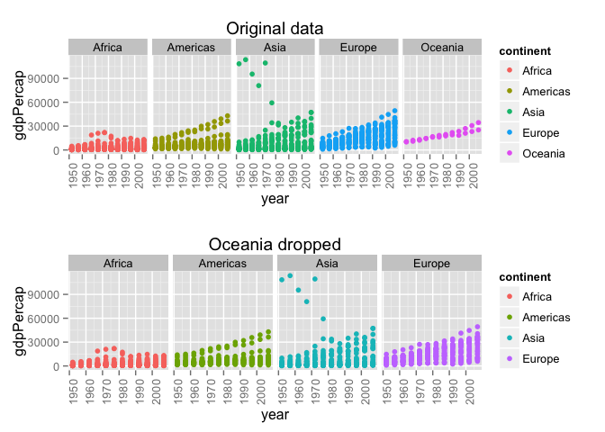
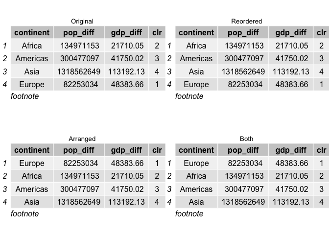
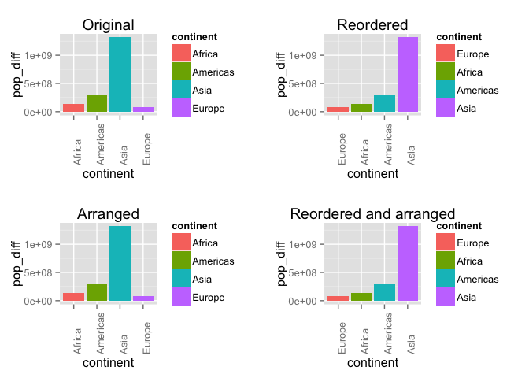
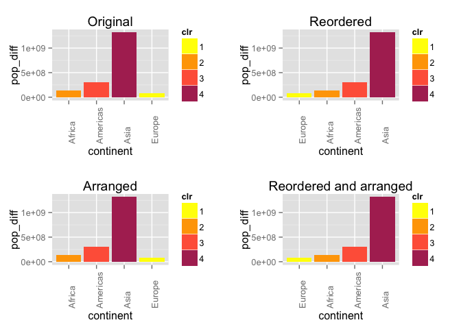

# Homework_5
David Choy  
October 28, 2015  


In Homework 5, my goals are to:  

1.  Reorder a factor in a principled way based on the data and demonstrate the effect in arranged data and in figures.
2.  Remake at least one previously made figure, in light of recent coverage of visualization design principles.
3.  Write a figure to file explicitly and include it my R Markdown report.
4.  Clean up my repo, to celebrate the completion of STAT 545 and/or to prepare for the glorious future of STAT 547.

### Load the libraries

For this homework, I will be using gridExtra,gtable and gplots to allow me to plot multiple plots neatly. 

```r
# Load the libraries
library(gapminder)
library(ggplot2)
library(gridExtra)
library(grid)
library(gtable)
suppressMessages(library(gplots)) # to convert color from character to hex using col2hex()
suppressPackageStartupMessages(library(dplyr))
```
### Factor management
#### Drop Oceania

Here, I will drop Oceania using filter to remove rows where continent == Oceania. Then, I will drop the levels associated with Oceania. I should be able to see differences in the:  

1.  number of rows should decrease after dropping Oceania 
2.  number of levels should drop for continent after dropping the unused levels of continent


```r
# Filter the data to exclude all Oceania data
gap_all <- tbl_df(gapminder);         # original data
gap_no_drop <- gap_all %>% filter(continent != "Oceania"); # data after dropping Oceania observations
gap_no_ocean <- gap_no_drop %>% droplevels(); # data after dropping all unused levels
# Find out the levels of the continents and number for rows before and after removing Oceania
lvl_bef <- gap_all$continent %>% nlevels()
nrow_bef <- gap_all %>% nrow()
lvl_aft <- gap_no_ocean$continent %>% nlevels()
nrow_aft <- gap_no_ocean %>% nrow()

bef_aft_df <- data.frame(levels = c(lvl_bef,lvl_aft), nrows = c(nrow_bef,nrow_aft)); 
dimnames(bef_aft_df)[[1]] <- c("Before dropping Oceania","After dropping Oceania"); 

knitr::kable(bef_aft_df,format = 'markdown')
```


|                        | levels| nrows|
|:-----------------------|------:|-----:|
|Before dropping Oceania |      5|  1704|
|After dropping Oceania  |      4|  1680|
  
As expected, the number of rows has dropped by 24(reflecting the number of observations for Oceania) and the number of levels for continent has dropped by 1(Oceania level is dropped). How does that look in a figure/geom_point plot?


```r
# Changes affected by filtering data and by changing factor levels
plot_all_gdp <- gap_all %>%  
  ggplot(aes(x = year, y = gdpPercap, color = continent)) +
  geom_point() +
  facet_grid(. ~ continent) +
  theme(axis.text.x = element_text(angle =90, vjust = 1, hjust=0)) +
  ggtitle("Original data")
plot_no_ocean_gdp <- gap_no_ocean %>% 
  ggplot(aes(x = year, y = gdpPercap, color = continent)) +
  geom_point() +
  facet_grid(. ~ continent) +
  theme(axis.text.x = element_text(angle = 90, vjust = 1, hjust=0)) +
  ggtitle("Oceania dropped")
grid.arrange(plot_all_gdp,plot_no_ocean_gdp,nrow =2)
```

 

Comparing the two plots, we can see that indeed, both the Oceania observations and levels in the legend have been discarded in the "Oceania dropped"" plot.

### Reorder the levels of continent
For the next part of this assignment, I will arrange and reorder the data based on Population disparity, which is the difference between the maximum population and minimum population of each continent. To do that, I will:  

1.  use group_by() and summarize() to calculate the summarized population disparity of each continent
2.  use reorder, arrange and both reorder and arrange on the dataset to compare the effects that each process has on the final dataframe and plot

```r
# Reorder the levels of continent 
gap_all_diffs <- gap_no_ocean %>% 
  group_by(continent) %>% 
  summarize(pop_diff = max(pop) - min(pop),
            gdp_diff = max(gdpPercap) - min(gdpPercap))
# additional code for assigning colors (will be relevant in the Visualization Design seciton)
gap_all_diffs <- gap_all_diffs %>% 
  mutate(clr = c("2","3","4","1"))

# using arrange(), I arrange the order of the rows of observations by their population disparity
gap_all_diffs_arrange <- gap_all_diffs %>% 
  ungroup() %>% 
  arrange(pop_diff)

# using reorder(), I change the factor levels of each continent by their population disparity
gap_all_diffs_reorder <- gap_all_diffs %>% 
  ungroup() %>% 
  mutate (continent = reorder(continent,pop_diff))

# using reorder() and arrange(), I do both
gap_all_diffs_dual <- gap_all_diffs %>% 
  ungroup() %>% 
  mutate (continent = reorder(continent,pop_diff)) %>% 
  arrange(pop_diff)
```

Now that I have 4 forms of data, original, arranged, ordered, arranged and ordered, I can compare the effects of arrange() and reorder() on both the table-form and plot-form of the data.


```r
grid.arrange(describe_table(gap_all_diffs,title_var = "Original"),                     
             describe_table(gap_all_diffs_reorder,title_var = "Reordered"),   
             describe_table(gap_all_diffs_arrange,title_var = "Arranged"),  
             describe_table(gap_all_diffs_dual,title_var = "Both"),
             ncol = 2)  
```

 

As we can see, arrange() will rearrange the rows of observations based on the variable specified. In my case, I told arrange() to sort the rows by the pop_diff variable. On the other hand, reorder() alone does not appear to do any rearranging in the dataframe. However, it has actually changed the factor levels for continent. The result of this can be seen in the following plots


```r
plot_diff_ori <- gap_all_diffs %>% 
  ggplot(aes(x=continent,y=pop_diff,fill = continent)) +
  geom_bar(stat="identity") +
  ggtitle("Original") +
  theme(axis.text.x = element_text(angle = 90, vjust = 1, hjust=0)) 
plot_diff_reorder <- gap_all_diffs_reorder %>% 
  ggplot(aes(x=continent,y=pop_diff,fill = continent)) +
  geom_bar(stat="identity") +
  ggtitle("Reordered") +
  theme(axis.text.x = element_text(angle = 90, vjust = 1, hjust=0)) 
plot_diff_arrange <- gap_all_diffs_arrange %>% 
  ggplot(aes(x=continent,y=pop_diff,fill = continent)) +
  geom_bar(stat="identity") +
  ggtitle("Arranged") +
  theme(axis.text.x = element_text(angle = 90, vjust = 1, hjust=0)) 
plot_diff_dual <- gap_all_diffs_dual %>% 
  ggplot(aes(x=continent,y=pop_diff,fill = continent)) +
  geom_bar(stat="identity") +
  ggtitle("Reordered and arranged") +
  theme(axis.text.x = element_text(angle = 90, vjust = 1, hjust=0)) 

grid.arrange(plot_diff_ori,
             plot_diff_reorder,
             plot_diff_arrange,
             plot_diff_dual)
```

 

Interestingly, arrange() had no effect on how the plot is presented proving that the factor levels (which control the way variables are organized) was not affected by arrange(). On the other hand, we see that reorder() changes the order in which the x-axis variable, continent, is presented. This is because I had used reorder() to change the factor level of continent.

In sum,

1. re-ordering the factor-levels changes the way the variables in plots are organized
2. re-ordering does not change the order of the rows of observation
3. conversely, arrange() does not change the ways plots are organized as factor levels are preserved
4. arrange does, however, change the rows of observation as can be seen in the table-view of the dataframe

### Visualization design
Both the use and choice of color is very important to visualization. As we can see in my "before" plots, 
the colors for each continent are not consistent between plots. This change in continent color is due to reorder() changing the factor levels. To fix the inconsistent country color, I had created an additional variable in the dataframe called 'clr' (color) which was not affected by the reorder() used on the continent variable. Additionally, I used colors in increasing intensity (Here, I use the colors resembling fire) to better reflect the increasing population disparity.

```r
flame <- col2hex(c("yellow","orange","tomato","maroon"))   # create custom color palette
# Here I use aes(fill = clr) to assign color based on the clr variable
# Additionally, I used scale_fill_manual() to use my custom color palette
plot_diff_ori_clr <- plot_diff_ori + aes(fill = clr) + scale_fill_manual(values = flame)
plot_diff_reorder_clr <- plot_diff_reorder + aes(fill = clr) + scale_fill_manual(values = flame)
plot_diff_arrange_clr <- plot_diff_arrange + aes(fill = clr) + scale_fill_manual(values = flame)
plot_diff_dual_clr <- plot_diff_dual + aes(fill = clr) + scale_fill_manual(values = flame)

plot_before <- arrangeGrob(plot_diff_ori,
                           plot_diff_reorder,
                           plot_diff_arrange,
                           plot_diff_dual)
plot_after <- arrangeGrob(plot_diff_ori_clr,
                          plot_diff_reorder_clr,
                          plot_diff_arrange_clr,
                          plot_diff_dual_clr)
grid.arrange(plot_before)
```

 

```r
grid.arrange(plot_after)
```

 

In the "before" plots, the continent colors were inconsistent between plots and the colors of each continent did not represent any value in the data. However, in the "after" plots, I made the colors consistent by affixing each continent's row to a new variable called clr. Then, I used a suitable color palette to reflect the increases in population disparity with the "redness" of the continent color.

### Writing figures to file
In this final part of the assignment (aside from the repo), I used ggsave() and the arguments, scale, width and height to specify a particular size ratio and scale I wanted for my file. I also demonstrated the difference between creating a plot file using a raster-based format (png) versus a vector_based format(svg). 

[ggsave_file](https://github.com/STAT545-UBC/wai-ho_choy/blob/master/Homework_5/Plot_diff_ori_clr.pdf)  

[png_file](https://github.com/STAT545-UBC/wai-ho_choy/blob/master/Homework_5/png_dual_plot.png)  

[svg_file](https://github.com/STAT545-UBC/wai-ho_choy/blob/master/Homework_5/svg_dual_plot.svg)


```r
#saving using ggsave
ggsave(plot = plot_diff_ori_clr, 
       filename = "Plot_diff_ori_clr.pdf",
       width = 20, height = 10, scale = 1.2) 

# saving using png
png("png_dual_plot.png",width=500,height=250)
grid.arrange(plot_after)
dev.off()
```

```
## quartz_off_screen 
##                 2
```

```r
#saving using svg
svg("svg_dual_plot.svg",width=15,height=10)
grid.arrange(plot_after)
dev.off()
```

```
## quartz_off_screen 
##                 2
```

### Repo

[Here](https://github.com/STAT545-UBC/wai-ho_choy) is my repo main page

### Thank you for reading!
