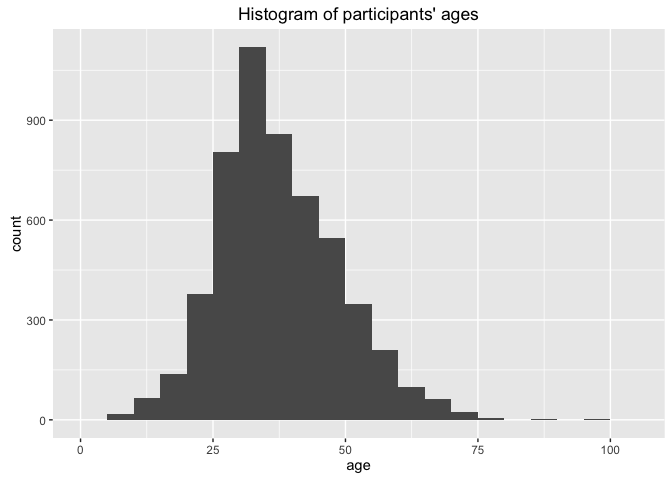
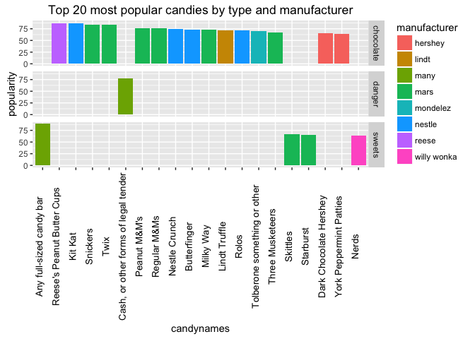
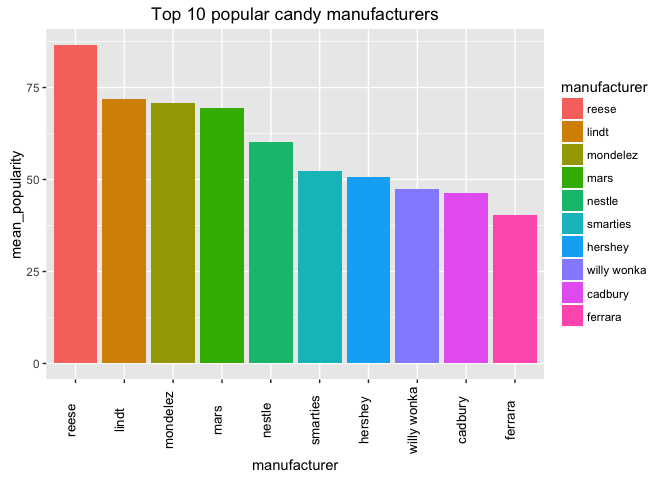

# Homework_7
David Choy  
November 14, 2015  

# Homework 7

For this homework, we are applying the skills we learned in data wrangling to a real life dataset. These datasets are usually messy and wrought with poorly-formatted values and variables. In our case, we are reading in data from a suvrey about candy choices and other miscellaneous questions. As expected, many participants do input poorly-formatted answers or gibberish as survey answers so it is our task to first clean up the data we are interested in. In my case, I want to look at the candy choices made by participants and their age. 

Homework steps available [here](https://stat545-ubc.github.io/hw07_data-wrangling-candy.html)

###1. Load the libraries
The first step to any R studio analysis is to load the required libraries


```r
library(readr)
suppressPackageStartupMessages(library(dplyr))
library(tidyr)
library(stringr)
library(ggplot2)
library(dplyr)
library(gridExtra)
```

###2. Read in the candy survey data
Our next step is to then read in the candy survey data which is in a .csv form. We will use read_csv() from the readr package as it allows us to use the argument col_types=cols(). This argument allows us to parse through the data to find the date and time values in a particular format. I then use glimpse() on the data to look at the types of variables available. I can already see some problems with the format of the data.

1.  the candy names are surrounded by square brackets which will make data sorting and subsetting harder later
2.  age (How old are you?) is not numeric. Being numeric allows for better data wielding for plotting and calculation
3.  using View(raw), I can see that some of the later responses are free field texts where the values are extremely non-standardized


```r
work_filepath <- "lecture_data/CANDY-HIERARCHY-2015 SURVEY-Responses.csv"
home_filepath <- "lecture_data/CANDY-HIERARCHY-2015 SURVEY-Responses.csv"

if (file.exists(work_filepath)) {
  candy_path <- work_filepath;
} else candy_path <- home_filepath;
raw <- read_csv(candy_path,col_types = cols(Timestamp = col_datetime("%m/%d/%Y %H:%M:%S")))
raw %>% glimpse()
```

```
## Observations: 5,658
## Variables: 124
## $ Timestamp                                                                                                         (time) ...
## $ How old are you?                                                                                                  (chr) ...
## $ Are you going actually going trick or treating yourself?                                                          (chr) ...
## $ [Butterfinger]                                                                                                    (chr) ...
## $ [100 Grand Bar]                                                                                                   (chr) ...
## $ [Anonymous brown globs that come in black and orange wrappers]                                                    (chr) ...
## $ [Any full-sized candy bar]                                                                                        (chr) ...
## $ [Black Jacks]                                                                                                     (chr) ...
## $ [Bonkers]                                                                                                         (chr) ...
## $ [Bottle Caps]                                                                                                     (chr) ...
## $ [Box’o’ Raisins]                                                                                                  (chr) ...
## $ [Brach products (not including candy corn)]                                                                       (chr) ...
## $ [Bubble Gum]                                                                                                      (chr) ...
## $ [Cadbury Creme Eggs]                                                                                              (chr) ...
## $ [Candy Corn]                                                                                                      (chr) ...
## $ [Vials of pure high fructose corn syrup, for main-lining into your vein]                                          (chr) ...
## $ [Candy that is clearly just the stuff given out for free at restaurants]                                          (chr) ...
## $ [Cash, or other forms of legal tender]                                                                            (chr) ...
## $ [Chiclets]                                                                                                        (chr) ...
## $ [Caramellos]                                                                                                      (chr) ...
## $ [Snickers]                                                                                                        (chr) ...
## $ [Dark Chocolate Hershey]                                                                                          (chr) ...
## $ [Dental paraphenalia]                                                                                             (chr) ...
## $ [Dots]                                                                                                            (chr) ...
## $ [Fuzzy Peaches]                                                                                                   (chr) ...
## $ [Generic Brand Acetaminophen]                                                                                     (chr) ...
## $ [Glow sticks]                                                                                                     (chr) ...
## $ [Broken glow stick]                                                                                               (chr) ...
## $ [Goo Goo Clusters]                                                                                                (chr) ...
## $ [Good N' Plenty]                                                                                                  (chr) ...
## $ [Gum from baseball cards]                                                                                         (chr) ...
## $ [Gummy Bears straight up]                                                                                         (chr) ...
## $ [Creepy Religious comics/Chick Tracts]                                                                            (chr) ...
## $ [Healthy Fruit]                                                                                                   (chr) ...
## $ [Heath Bar]                                                                                                       (chr) ...
## $ [Hershey’s Kissables]                                                                                             (chr) ...
## $ [Hershey’s Milk Chocolate]                                                                                        (chr) ...
## $ [Hugs (actual physical hugs)]                                                                                     (chr) ...
## $ [Jolly Rancher (bad flavor)]                                                                                      (chr) ...
## $ [Jolly Ranchers (good flavor)]                                                                                    (chr) ...
## $ [Kale smoothie]                                                                                                   (chr) ...
## $ [Kinder Happy Hippo]                                                                                              (chr) ...
## $ [Kit Kat]                                                                                                         (chr) ...
## $ [Hard Candy]                                                                                                      (chr) ...
## $ [Lapel Pins]                                                                                                      (chr) ...
## $ [LemonHeads]                                                                                                      (chr) ...
## $ [Licorice]                                                                                                        (chr) ...
## $ [Licorice (not black)]                                                                                            (chr) ...
## $ [Lindt Truffle]                                                                                                   (chr) ...
## $ [Lollipops]                                                                                                       (chr) ...
## $ [Mars]                                                                                                            (chr) ...
## $ [Mary Janes]                                                                                                      (chr) ...
## $ [Maynards]                                                                                                        (chr) ...
## $ [Milk Duds]                                                                                                       (chr) ...
## $ [LaffyTaffy]                                                                                                      (chr) ...
## $ [Minibags of chips]                                                                                               (chr) ...
## $ [JoyJoy (Mit Iodine)]                                                                                             (chr) ...
## $ [Reggie Jackson Bar]                                                                                              (chr) ...
## $ [Pixy Stix]                                                                                                       (chr) ...
## $ [Nerds]                                                                                                           (chr) ...
## $ [Nestle Crunch]                                                                                                   (chr) ...
## $ [Now'n'Laters]                                                                                                    (chr) ...
## $ [Pencils]                                                                                                         (chr) ...
## $ [Milky Way]                                                                                                       (chr) ...
## $ [Reese’s Peanut Butter Cups]                                                                                      (chr) ...
## $ [Tolberone something or other]                                                                                    (chr) ...
## $ [Runts]                                                                                                           (chr) ...
## $ [Junior Mints]                                                                                                    (chr) ...
## $ [Senior Mints]                                                                                                    (chr) ...
## $ [Mint Kisses]                                                                                                     (chr) ...
## $ [Mint Juleps]                                                                                                     (chr) ...
## $ [Mint Leaves]                                                                                                     (chr) ...
## $ [Peanut M&M’s]                                                                                                    (chr) ...
## $ [Regular M&Ms]                                                                                                    (chr) ...
## $ [Mint M&Ms]                                                                                                       (chr) ...
## $ [Ribbon candy]                                                                                                    (chr) ...
## $ [Rolos]                                                                                                           (chr) ...
## $ [Skittles]                                                                                                        (chr) ...
## $ [Smarties (American)]                                                                                             (chr) ...
## $ [Smarties (Commonwealth)]                                                                                         (chr) ...
## $ [Chick-o-Sticks (we don’t know what that is)]                                                                     (chr) ...
## $ [Spotted Dick]                                                                                                    (chr) ...
## $ [Starburst]                                                                                                       (chr) ...
## $ [Swedish Fish]                                                                                                    (chr) ...
## $ [Sweetums]                                                                                                        (chr) ...
## $ [Those odd marshmallow circus peanut things]                                                                      (chr) ...
## $ [Three Musketeers]                                                                                                (chr) ...
## $ [Peterson Brand Sidewalk Chalk]                                                                                   (chr) ...
## $ [Peanut Butter Bars]                                                                                              (chr) ...
## $ [Peanut Butter Jars]                                                                                              (chr) ...
## $ [Trail Mix]                                                                                                       (chr) ...
## $ [Twix]                                                                                                            (chr) ...
## $ [Vicodin]                                                                                                         (chr) ...
## $ [White Bread]                                                                                                     (chr) ...
## $ [Whole Wheat anything]                                                                                            (chr) ...
## $ [York Peppermint Patties]                                                                                         (chr) ...
## $ Please leave any remarks or comments regarding your choices.                                                      (chr) ...
## $ Please list any items not included above that give you JOY.                                                       (chr) ...
## $ Please list any items not included above that give you DESPAIR.                                                   (chr) ...
## $ Guess the number of mints in my hand.                                                                             (chr) ...
## $ Betty or Veronica?                                                                                                (chr) ...
## $ Check all that apply: "I cried tears of sadness at the end of  ____________"                                      (chr) ...
## $ "That dress* that went viral early this year - when I first saw it, it was ________"                              (chr) ...
## $ Fill in the blank: "Taylor Swift is a force for ___________"                                                      (chr) ...
## $ What is your favourite font?                                                                                      (chr) ...
## $ If you squint really hard, the words "Intelligent Design" would look like.                                        (chr) ...
## $ Fill in the blank: "Imitation is a form of ____________"                                                          (chr) ...
## $ Please estimate the degree(s) of separation you have from the following celebrities [JK Rowling]                  (chr) ...
## $ Please estimate the degree(s) of separation you have from the following celebrities [JJ Abrams]                   (chr) ...
## $ Please estimate the degree(s) of separation you have from the following celebrities [Beyoncé]                     (chr) ...
## $ Please estimate the degree(s) of separation you have from the following celebrities [Bieber]                      (chr) ...
## $ Please estimate the degree(s) of separation you have from the following celebrities [Kevin Bacon]                 (chr) ...
## $ Please estimate the degree(s) of separation you have from the following celebrities [Francis Bacon (1561 - 1626)] (chr) ...
## $ [Sea-salt flavored stuff, probably chocolate, since this is the "it" flavor of the year]                          (chr) ...
## $ [Necco Wafers]                                                                                                    (chr) ...
## $ Which day do you prefer, Friday or Sunday?                                                                        (chr) ...
## $ Please estimate the degrees of separation you have from the following folks [Bruce Lee]                           (chr) ...
## $ Please estimate the degrees of separation you have from the following folks [JK Rowling]                          (chr) ...
## $ Please estimate the degrees of separation you have from the following folks [Malala Yousafzai]                    (chr) ...
## $ Please estimate the degrees of separation you have from the following folks [Thom Yorke]                          (chr) ...
## $ Please estimate the degrees of separation you have from the following folks [JJ Abrams]                           (chr) ...
## $ Please estimate the degrees of separation you have from the following folks [Hillary Clinton]                     (chr) ...
## $ Please estimate the degrees of separation you have from the following folks [Donald Trump]                        (chr) ...
## $ Please estimate the degrees of separation you have from the following folks [Beyoncé Knowles]                     (chr) ...
```

###3. Creating an ID variable
We know that the data is messy and so, we will have to do some transformation and trimming. Before making any changes to the data, we will give each row (observation) an ID so that we don't lose track of whose data is whose when we do recombine dataframes/data. To create and ID variable, I have borrowed Jenny's sprintf() and corresponding arguments. Sprintf() returns a character vector of strings that is made up of formatted strings. In this case, the format is "ID%04". "ID" will literally write out "ID" while "%04" refers to a padding of up to 4 zeroes. "d" refers to digit which is decided by row_number() in our case.


```r
raw_with_id <- raw %>%                        # sprintf() -> returns a character vector of strings  
  mutate(id = sprintf("ID%04d", row_number()))# %04 means -> pad the digit up to 4 zeroes e.g. ID4 -> ID0004

raw_with_id2 <- raw_with_id %>%                
  select(id,                                  # rename age and trick_or_treat
         age = starts_with("How"),            # starts_with() pulls out strings that start with the target string
         trick_treat = starts_with("Are you going"),
         everything()) %>% select(-Timestamp)
knitr::kable(raw_with_id2 %>% .[1:5,1:7],format = 'markdown')
```


|id     |age |trick_treat |[Butterfinger] |[100 Grand Bar] |[Anonymous brown globs that come in black and orange wrappers] |[Any full-sized candy bar] |
|:------|:---|:-----------|:--------------|:---------------|:--------------------------------------------------------------|:--------------------------|
|ID0001 |35  |No          |JOY            |NA              |DESPAIR                                                        |JOY                        |
|ID0002 |41  |No          |JOY            |JOY             |DESPAIR                                                        |JOY                        |
|ID0003 |33  |No          |DESPAIR        |DESPAIR         |DESPAIR                                                        |JOY                        |
|ID0004 |31  |No          |JOY            |JOY             |DESPAIR                                                        |JOY                        |
|ID0005 |30  |No          |NA             |JOY             |DESPAIR                                                        |JOY                        |

```r
length(raw_with_id2)
```

```
## [1] 124
```

###4. Cleaning up age values and candy names
With the ID created for each observation, we can trim and transform our values while making sure we are tracking the observation IDs. For cleaning, I will focus on cleaning 'age' and candy names as they are the only variables I am interested in.

####A. Cleaning age
For age, we want:  

*  To see if age is reasonable (5-100) and in the correct format(a number). 
*  To remove all non-number entries, I use as.integer() to coerce the character strings into integers.
    *  If the entries are numbers in character form such as "1", "15", 124.12", they will be co-erced into proper integers. 
    *  However, if the entries are words or gibberish such as "one", "potato", "4$Y)()", then it should return NAs which I will filter out


```r
as.integer(c("1","15","124.12"))      #as.integer() converts numbers to integers
as.integer(c("one","potato","4$Y)(")) #non-numbers are converted into NAs
```

```
## [1]   1  15 124
## [1] NA NA NA
```

```r
raw_clean_age <- raw_with_id2 %>% 
                 mutate(age = as.integer(age))          #converting nums to integers, non-nums to NAs
raw_clean_age <- raw_clean_age %>%                      #filter for age(5-100)
                 filter(!is.na(age)) %>% 
                 filter(age < 100) %>% 
                 filter(age > 5) 
raw_clean_age %>% ggplot(aes(x=age)) + 
                geom_histogram(stat="bin",binwidth=5) +  #plot the histogram for age
                ggtitle("Histogram of participants' ages")
```

 

```r
raw_clean_age$age %>% median()              
```

```
## [1] 35
```

From this plot, we can see that age is in a relatively reasonable range and centered around a median of 35 years old. 

####B. Cleaning candy names
For candy names, I used Jenny's regex code to extract only the column names which had a surrounding [ ] bracket. These are the candy names. The brackets are removed and then the new column names replace the old candy names.


```r
candy_oldnew_names <-
  data_frame(orig_name = names(raw_clean_age)) %>%                         #create new dataframe
  mutate(is_candy = str_detect(orig_name,"^\\["),                          #find srring starting with [
         new_name = str_replace_all(orig_name, "(^\\[)(.*)(\\]$)", "\\2"), #replace oldnames with the 2nd group
         new_name = str_replace_all(new_name, '["’]', "'"),                #replace all " or ' with '
         is_changed = orig_name != new_name)
knitr::kable(candy_oldnew_names %>% head(10),format = 'markdown')
```


|orig_name                                                      |is_candy |new_name                                                     |is_changed |
|:--------------------------------------------------------------|:--------|:------------------------------------------------------------|:----------|
|id                                                             |FALSE    |id                                                           |FALSE      |
|age                                                            |FALSE    |age                                                          |FALSE      |
|trick_treat                                                    |FALSE    |trick_treat                                                  |FALSE      |
|[Butterfinger]                                                 |TRUE     |Butterfinger                                                 |TRUE       |
|[100 Grand Bar]                                                |TRUE     |100 Grand Bar                                                |TRUE       |
|[Anonymous brown globs that come in black and orange wrappers] |TRUE     |Anonymous brown globs that come in black and orange wrappers |TRUE       |
|[Any full-sized candy bar]                                     |TRUE     |Any full-sized candy bar                                     |TRUE       |
|[Black Jacks]                                                  |TRUE     |Black Jacks                                                  |TRUE       |
|[Bonkers]                                                      |TRUE     |Bonkers                                                      |TRUE       |
|[Bottle Caps]                                                  |TRUE     |Bottle Caps                                                  |TRUE       |

Using this set of bracket-less candy names, we replace the old candy names with the new candy names.


```r
names(raw_clean_age) <- candy_oldnew_names$new_name     # replace candy names
knitr::kable(raw_clean_age %>% head(10) %>% .[1:6],format = 'markdown')
```


|id     | age|trick_treat |Butterfinger |100 Grand Bar |Anonymous brown globs that come in black and orange wrappers |
|:------|---:|:-----------|:------------|:-------------|:------------------------------------------------------------|
|ID0001 |  35|No          |JOY          |NA            |DESPAIR                                                      |
|ID0002 |  41|No          |JOY          |JOY           |DESPAIR                                                      |
|ID0003 |  33|No          |DESPAIR      |DESPAIR       |DESPAIR                                                      |
|ID0004 |  31|No          |JOY          |JOY           |DESPAIR                                                      |
|ID0005 |  30|No          |NA           |JOY           |DESPAIR                                                      |
|ID0006 |  38|No          |JOY          |JOY           |DESPAIR                                                      |
|ID0007 |  48|No          |JOY          |JOY           |DESPAIR                                                      |
|ID0008 |  39|No          |DESPAIR      |JOY           |DESPAIR                                                      |
|ID0010 |  54|No          |JOY          |JOY           |DESPAIR                                                      |
|ID0011 |  40|No          |JOY          |JOY           |DESPAIR                                                      |

The candy names are now bracket-less!

###5. Reshaping of the candy variable
Now that we have cleaned up age and candy names, we can begin reshaping the data. For this purpose, I am going to use gather() from the tidyr package. Since gather() restructures the data based on the columns selected, I want to first make sure to exclude any unnecessary columns by selecting only "id","age","trick_or_treat" and all of the candy variables in candy_names.

####A. Selecting id,age,trick_or_treat and candy_names
As we can see below:

1.  selecting id,age,trick_or_treat is a breeze. 
2.  However, selecting only the candies in the next 100+ columns is difficult. Luckily, we already have a list of candy names to use from before (candy_names)


```r
candy_names <- candy_oldnew_names %>% filter(is_candy) %>% .[["new_name"]];   #get a vector of candy names
candy_ready <- raw_clean_age %>% select(one_of(c("id",           # select id
                                                 "age",          # select age
                                                 "trick_treat",  # select t_o_t
                                                 candy_names)))  # select all columns that match each of the candy_names
knitr::kable(candy_ready %>% head(10) %>% .[1:6],format = 'markdown')
```


|id     | age|trick_treat |Butterfinger |100 Grand Bar |Anonymous brown globs that come in black and orange wrappers |
|:------|---:|:-----------|:------------|:-------------|:------------------------------------------------------------|
|ID0001 |  35|No          |JOY          |NA            |DESPAIR                                                      |
|ID0002 |  41|No          |JOY          |JOY           |DESPAIR                                                      |
|ID0003 |  33|No          |DESPAIR      |DESPAIR       |DESPAIR                                                      |
|ID0004 |  31|No          |JOY          |JOY           |DESPAIR                                                      |
|ID0005 |  30|No          |NA           |JOY           |DESPAIR                                                      |
|ID0006 |  38|No          |JOY          |JOY           |DESPAIR                                                      |
|ID0007 |  48|No          |JOY          |JOY           |DESPAIR                                                      |
|ID0008 |  39|No          |DESPAIR      |JOY           |DESPAIR                                                      |
|ID0010 |  54|No          |JOY          |JOY           |DESPAIR                                                      |
|ID0011 |  40|No          |JOY          |JOY           |DESPAIR                                                      |

####B. Reshaping the candy variables using gather()
Instead of having the candy variables separate, gathering them into 1 column would allow us to use more dplyr. I also want to select the top ten most popular candies. For this purpose, I will use gather() to create a key:value pair. I also set the columns I want to gather using the final argument "4:length(candy_ready)" which selects all the candy name columns. I then count the number of joy, despair and NA responses for each candy


```r
candy_gathered <- gather(candy_ready,"candynames","review",4:length(candy_ready))  #reshape all the candy columns into key:value pairs
candy_counts <- candy_gathered %>% group_by(candynames,review) %>% summarize(count = n())  # count joy,despair,NA
knitr::kable(candy_counts %>% head(10),format='markdown')
```


|candynames                                                   |review  | count|
|:------------------------------------------------------------|:-------|-----:|
|Butterfinger                                                 |DESPAIR |  1056|
|Butterfinger                                                 |JOY     |  3934|
|Butterfinger                                                 |NA      |   362|
|100 Grand Bar                                                |DESPAIR |  1474|
|100 Grand Bar                                                |JOY     |  3267|
|100 Grand Bar                                                |NA      |   611|
|Anonymous brown globs that come in black and orange wrappers |DESPAIR |  4552|
|Anonymous brown globs that come in black and orange wrappers |JOY     |   522|
|Anonymous brown globs that come in black and orange wrappers |NA      |   278|
|Any full-sized candy bar                                     |DESPAIR |   349|

####C. Creating a new column called "popularity" to represent both joy and despair
Because joy, despair and NA are non-numerics, it is slightly harder to apply numerical comparisons. So, I will be creating a new value called popularity that measures the popularity of a candy by dividing the number of Joy responses by the total response (joy + despair + NA). Below, I have subsetted the counts for joy, despair and NA values for each candy. Then, I recombined the 3 counts into a new dataframe called candy_counts_split. Having the 3 counts as 3 separate variables enables me to make my popularity calculation.


```r
joy_df <- candy_counts %>% ungroup() %>% filter(review == "JOY");names(joy_df)[3] <- "joy_count"
despair_df <- candy_counts %>% filter(review == "DESPAIR");names(despair_df)[3] <- "despair_count"
na_df <- candy_counts %>% filter(is.na(review)); names(na_df)[3] <- "na_count"

candy_counts_split <- cbind(subset(joy_df,select = -c(review)),
                            despair_count = despair_df$despair_count,
                            na_count = na_df$na_count)
candy_counts_popular <- candy_counts_split %>% mutate(popularity = 100 * joy_count/(joy_count+despair_count+na_count))
knitr::kable(candy_counts_popular[-3,] %>% head(),format='markdown')
```


|   |candynames               | joy_count| despair_count| na_count| popularity|
|:--|:------------------------|---------:|-------------:|--------:|----------:|
|1  |Butterfinger             |      3934|          1056|      362|  73.505232|
|2  |100 Grand Bar            |      3267|          1474|      611|  61.042601|
|4  |Any full-sized candy bar |      4752|           349|      251|  88.789238|
|5  |Black Jacks              |       319|          4086|      947|   5.960389|
|6  |Bonkers                  |       510|          3719|     1123|   9.529148|
|7  |Bottle Caps              |      1970|          2823|      559|  36.808670|

####D. Adding additional candy info
Lets add additional info (candy type & manufacturer) to our candies. I got this information this manually using google search and excel as it was only 95 variables. Not practical for larger datasets and tiresome. But I wanted to see what I could find when I combined this information with the candy counts. 


```r
candy_manufacture_type <- read_csv("candy-manu-type.csv")    #read in candy info  
candy_counts_complete <- merge(candy_manufacture_type,       #merge candy info with candy counts
                               candy_counts_popular,
                               by.x="candynames")            #merge using the "candynames" column as a shared column
candy_counts_top_20 <- candy_counts_complete %>% arrange(-popularity) %>% head(20)  #show only the top 20 candies
knitr::kable(candy_counts_top_20, format='markdown')
```


|candynames                           |manufacturer |type      | joy_count| despair_count| na_count| popularity|
|:------------------------------------|:------------|:---------|---------:|-------------:|--------:|----------:|
|Any full-sized candy bar             |many         |sweets    |      4752|           349|      251|   88.78924|
|Reese's Peanut Butter Cups           |reese        |chocolate |      4638|           481|      233|   86.65919|
|Kit Kat                              |nestle       |chocolate |      4616|           470|      266|   86.24813|
|Snickers                             |mars         |chocolate |      4449|           629|      274|   83.12780|
|Twix                                 |mars         |chocolate |      4442|           574|      336|   82.99701|
|Cash, or other forms of legal tender |many         |danger    |      4167|           901|      284|   77.85874|
|Peanut M&M's                         |mars         |chocolate |      4089|           955|      308|   76.40135|
|Regular M&Ms                         |mars         |chocolate |      4069|           919|      364|   76.02765|
|Nestle Crunch                        |nestle       |chocolate |      3984|           951|      417|   74.43946|
|Butterfinger                         |nestle       |chocolate |      3934|          1056|      362|   73.50523|
|Milky Way                            |mars         |chocolate |      3874|          1048|      430|   72.38416|
|Lindt Truffle                        |lindt        |chocolate |      3848|          1102|      402|   71.89836|
|Rolos                                |nestle       |chocolate |      3799|          1123|      430|   70.98281|
|Tolberone something or other         |mondelez     |chocolate |      3788|          1113|      451|   70.77728|
|Three Musketeers                     |mars         |chocolate |      3615|          1274|      463|   67.54484|
|Skittles                             |mars         |sweets    |      3571|          1363|      418|   66.72272|
|Starburst                            |mars         |sweets    |      3514|          1394|      444|   65.65770|
|Dark Chocolate Hershey               |hershey      |chocolate |      3486|          1521|      345|   65.13453|
|York Peppermint Patties              |hershey      |chocolate |      3444|          1477|      431|   64.34978|
|Nerds                                |willy wonka  |sweets    |      3410|          1551|      391|   63.71450|

Above, I sorted the candies by highest popularity. There is still a lot of hidden trends however so I decided to make a plot. Below I made a function for plotting. The reason for using a function instead of just plotting is because I was testing various options for fill= and facet_grid(formula=).


```r
plot_candy <- function(df,
                       filler = "type",
                       facet_split = "type",
                       envir=environment()) {
  plot1 <- df %>% 
    mutate(candynames = reorder(candynames,-popularity)) %>%  
    ggplot(aes_string(x="candynames", y = "popularity", fill = filler)) + 
    geom_bar(stat="identity") +
    theme(axis.text.x = element_text(angle = 90, vjust = 0, hjust=0.5,size = 10, color = "black")) +
    facet_grid(as.formula(paste(facet_split," ~ ."))) +
    ggtitle("Top 20 most popular candies by type and manufacturer")
  plot1$plot_env <- envir
  plot1
}
plot_candy(candy_counts_top_20,filler = "manufacturer")
```

 

In the plot above, we can see that chocolate is the most popular candy, followed by cash and then sweets. Now, of course, cash isn't a real candy but for the purpose of this exercise, I left it in. To remove it, I can just use filter(type != danger) on the dataset to remove it. In this plot, I also notice that there are 8 main manufacturers of candy in the top 20 list. I am interested to see which company dominates in the top 20 so I make a table.


```r
manufacture_popularity_top_20 <- candy_counts_top_20 %>% 
  group_by(manufacturer) %>%                     # group the results by manufacturer
  summarize(manufacturer_popularity = n()) %>%   # count the number of observations (candies) for each manufacturer
  arrange(-manufacturer_popularity)              # arrange in descending order of popularity
knitr::kable(manufacture_popularity_top_20,format = 'markdown')
```


|manufacturer | manufacturer_popularity|
|:------------|-----------------------:|
|mars         |                       8|
|nestle       |                       4|
|hershey      |                       2|
|many         |                       2|
|lindt        |                       1|
|mondelez     |                       1|
|reese        |                       1|
|willy wonka  |                       1|

From this table it is apparent that there are 8 manufacturers on this list, the most common of which is Mars Inc. However, while this suggests that Mars Inc candies are the most popular among the top 20 candies, do Mars Inc. products generate the best reviews overall (all candies)?


```r
manufacture_popularity_all_top_10 <- candy_counts_complete %>% 
  group_by(manufacturer) %>%          # group results for each manufacturer
  summarize(mean_popularity = mean(popularity)) %>%   # summarize using mean()
  arrange(-mean_popularity) %>%       # arrange in descending order or popularity
  mutate(manufacturer = reorder(manufacturer,-mean_popularity)) %>% head(10)
knitr::kable(manufacture_popularity_all_top_10,format='markdown')
```


|manufacturer | mean_popularity|
|:------------|---------------:|
|reese        |        86.65919|
|lindt        |        71.89836|
|mondelez     |        70.77728|
|mars         |        69.55531|
|nestle       |        60.18544|
|smarties     |        52.18610|
|hershey      |        50.62490|
|willy wonka  |        47.46512|
|cadbury      |        46.24439|
|ferrara      |        40.48019|

```r
manufacturer_plot_top_10 <- manufacture_popularity_all_top_10 %>% 
  ggplot(aes(x=manufacturer,y=mean_popularity, fill = manufacturer)) + 
  geom_bar(stat="identity") +
  theme(axis.text.x = element_text(angle = 90, vjust = 0, hjust=0.5,size = 10, color = "black")) +
  ggtitle("Top 10 popular candy manufacturers")
manufacturer_plot_top_10 
```

 

According to the table and plot, on average, Reese candy products have the highest average popularity. This is interesting because Mars Inc. was the most commong manufacturer for the top 20 producst but Reese led in popularity overall. This demonstrates a disrepancy between sampling from the top 20% (20/95 candies) and sampling from the full population (95/95 candies). If these numbers represent sales, then we can say that although Mars Inc. products are super popular (always listed in top 20), it is the Reese products that ultimately sell more. That would require more data to prove.

Done! Thanks!
