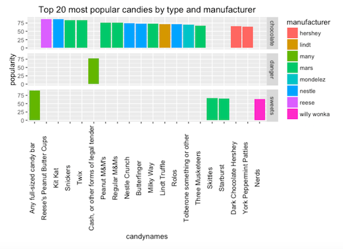

# Stat 545 and 547M Homework
by David Choy

  

###Overview  
As part of Dr. Jenny Bryan's STAT545 and STAT547M data wrangling courses, we wrote R code and Rmd reports to present our understanding of R data wrangling and visualization. Homework 1-5 is part of STAT545 covering basic concepts of data readin, manipulation and plotting. Homework 6-10 is part of STAT547M covering data cleanup (munging) 

### Repo contents
1. Homework 1 [Learning R markdown and git](https://github.com/hochoy/r_stat545/tree/master/Homework_1/README.md)
2. Homework 2 [Smelltesting gapminder data with base and ggplot2](https://github.com/hochoy/r_stat545/tree/master/Homework_2/Homework2.md)
3. Homework 3 [Finding trends in gapminder with dplyr and ggplot2](https://github.com/hochoy/r_stat545/tree/master/Homework_3/Homework3.md)
4. Homework 4 [Creating "split, apply, combine" functions to automate trend-finding in gapminder](https://github.com/hochoy/r_stat545/tree/master/Homework_4/Homework_4.md)
5. Homework 5 [STAT545 wrapup: Order factor levels, choosing color schemes and writing figures to file](https://github.com/hochoy/r_stat545/tree/master/Homework_5/Homework_5.md)
6. Homework 7 [Data munging real-life datasets with dplyr, tidyr, stringr and regular expressions: Halloween Candy](https://github.com/hochoy/r_stat545/tree/master/Homework_7/Homework_7.md)
7. Homework 8 [Writing your own R package](https://github.com/hochoy/r_stat545/tree/master/Homework_8/Homework_8.md)
8. Homework 9 [Automating a data analysis pipeline](https://github.com/hochoy/automation)
9. Homework 10 [Data from the web](https://github.com/hochoy/r_stat545/blob/master/Homework_10/Homework_10.md)  
10. Homework 11[Create a Shiny App](https://github.com/hochoy/r_stat545/tree/master/Homework_11)  

The Course is [here](http://stat545-ubc.github.io/index.html)
The discussion repo is [here](https://github.com/STAT545-UBC/Discussion/issues)